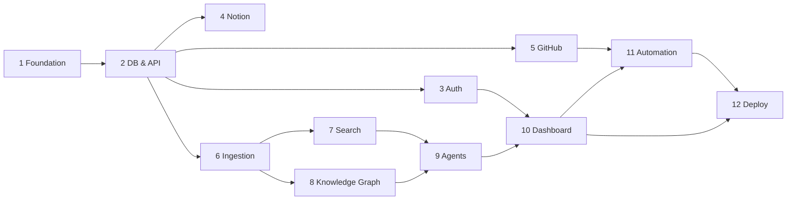

# 00 — Implementation Roadmap

This roadmap divides Hermes Workspace OS into **12 milestones**. Each milestone is a
shippable increment with clear entry/exit criteria. **Development proceeds one
milestone at a time, with an approval gate between each.** No milestone starts until
the previous one is accepted.

## Guiding rules

- **Vertical slices over horizontal layers.** Each milestone delivers something a user
  or operator can actually run, not just a layer of plumbing.
- **Contracts first.** API schemas, DB migrations, and plugin interfaces are defined
  before the code that uses them.
- **Tested & documented at the gate.** A milestone is "done" only when its tests pass
  in CI and its docs are updated.
- **Backwards-compatible migrations.** Every schema change ships as a reversible
  migration.

---

## Milestone 0 — Engineering Foundation ✅ (this repository)

**Goal:** Complete architecture and documentation before any application code.

- [x] `/docs/01`–`15` written
- [x] Roadmap with milestones and approval gates
- [x] Repo scaffolding (README, LICENSE, .gitignore)

**Exit criteria:** Docs reviewed and approved. → *Approval gate before Milestone 1.*

---

## Milestone 1 — Project Foundation

**Goal:** A runnable monorepo skeleton with tooling, CI, and local dev stack.

- Monorepo layout (`apps/web`, `services/api`, `services/worker`, `packages/*`,
  `infra/`).
- `docker-compose.yml` bringing up Postgres, Redis, Neo4j, Qdrant, Meilisearch, MinIO.
- Tooling: `ruff` + `mypy` + `pytest` (Python), `eslint` + `tsc` + `vitest` (TS).
- CI pipeline (lint, type-check, test) on GitHub Actions.
- `.env.example`, `CONTRIBUTING.md`, `Makefile`/`justfile` with common commands.
- Health-check endpoints on API and web; "hello world" e2e smoke test.

**Exit:** `docker compose up` yields a green health dashboard; CI passes.

---

## Milestone 2 — Database & API

**Goal:** The core domain model and CRUD API — Hermes as the source of record.

- SQLAlchemy models + Alembic migrations for core entities (see `05-DATABASE_DESIGN`).
- FastAPI app with layered architecture (routers → services → repositories).
- Pydantic schemas and OpenAPI docs.
- Entities: Workspace, User, Project, Task, Document, Repository, Research, Asset,
  Agent, plus join/tag tables.
- Repository pattern + unit-of-work; seed data + factory fixtures.
- Contract tests against the OpenAPI schema.

**Exit:** Full CRUD for core entities with tests; OpenAPI published.

---

## Milestone 3 — Authentication & Authorization

**Goal:** Secure multi-tenant access.

- Auth.js (frontend) + FastAPI session/JWT verification.
- Optional Authentik (OIDC) for self-hosted SSO.
- RBAC: workspace/project roles (owner, admin, editor, viewer); resource-level checks.
- Secrets manager abstraction + encrypted API-key vault (see `03`/security).
- Audit-log table and middleware.

**Exit:** Protected endpoints, role enforcement tests, encrypted secret storage.

---

## Milestone 4 — Notion Integration

**Goal:** Two-way sync with Notion as an interface (never source of record).

- Notion plugin implementing the Integration provider interface (`06`).
- Sync engine: outbound (Hermes→Notion) + inbound (webhook/poll Notion→Hermes).
- Mapping layer for the 10 Notion databases (`07`).
- Conflict resolution (Hermes wins by default; configurable) + idempotency keys.
- Disconnect test: system fully functional with Notion unplugged.

**Exit:** Round-trip sync for Projects/Tasks; disconnect test passes.

---

## Milestone 5 — GitHub Integration

**Goal:** Repository, commit, issue, and PR sync + analysis hooks.

- GitHub App / token auth; repo linking to Projects.
- Webhook receiver + backfill sync for commits, branches, issues, PRs.
- Commit and PR analysis jobs feeding the ingestion pipeline (`08`).
- Issue ↔ Task bidirectional mapping.

**Exit:** Linked repo streams activity into a Project; issues sync to tasks.

---

## Milestone 6 — File Ingestion

**Goal:** Automatic processing pipeline for uploaded and synced content.

- Upload API → MinIO storage → Celery ingestion pipeline (`13`).
- Extractors: PDF, DOCX, Markdown, images (OCR/caption), ZIP, repositories.
- Steps: type detection → extract → chunk → summarize → tag → embed → relate → store.
- Content-addressed dedup; virus/type guards; provenance tracking.

**Exit:** Upload a PDF → summary, tags, embeddings, and relations produced.

---

## Milestone 7 — Search System

**Goal:** Universal hybrid search across all content.

- Meilisearch keyword index + Qdrant vector index (`12`).
- Hybrid ranking (reciprocal rank fusion) + reranking hook.
- Unified `/search` API with source facets (Notion, GitHub, files, docs, research).
- Permission-aware filtering.

**Exit:** Single query returns fused, permission-scoped results across sources.

---

## Milestone 8 — Knowledge Graph

**Goal:** Entity/relationship graph + GraphRAG retrieval.

- Neo4j schema + sync from Postgres/ingestion (`11`).
- Entity extraction and relationship inference during ingestion.
- Graph query API; GraphRAG retrieval combining graph traversal + vector search.
- Graph visualization endpoint feeding the UI.

**Exit:** Ingested content produces a navigable graph; GraphRAG answers queries.

---

## Milestone 9 — AI Agents

**Goal:** Dynamic, LangGraph-based agent orchestration.

- Agent framework: lifecycle, memory, permissions, tools, comms (`10`).
- Provider abstraction (OpenAI/Anthropic/Gemini/Ollama) via the AI plugin interface.
- Project agent templates (PM, Research, Docs, Developer, Review, Testing, Release).
- Tool registry (search, KG, GitHub, files, Notion); artifact production.
- Ephemeral agent scheduling (no idle agents running).
- **Departments + Harness** (designed in `16-AGENT_DEPARTMENTS.md`): agents grouped into
  Engineering and Knowledge & Operations departments; durable checkpoint/resume so a single
  task can run for days; the unified Knowledge & Memory Hub.

**Exit:** Creating a project spins up its agent team on demand; agents produce artifacts.

---

## Milestone 10 — Dashboard

**Goal:** The primary web workspace.

- Next.js dashboard: universal search, AI assistant, projects, kanban, roadmaps,
  research queue, GitHub activity, recent files, knowledge graph, quick actions (`15`).
- Project workspace with all sub-views (docs, wiki, tasks, files, timeline, etc.).
- React Flow graphs, Mermaid diagrams, ECharts analytics.

**Exit:** End-to-end: create project → manage tasks → search → view graph in the UI.

---

## Milestone 11 — Automation Engine

**Goal:** n8n-based workflows + native triggers.

- Embedded/managed n8n + Hermes nodes (`14`).
- Native event bus → workflow triggers (file uploaded, PR opened, task done, …).
- Workflow templates (auto-doc on repo change, research digest, release notes).

**Exit:** An event triggers a workflow that updates Hermes and Notion.

---

## Milestone 12 — Deployment & Hardening

**Goal:** Production-ready self-hosting.

- Production Docker Compose + optional Helm chart.
- Backups (Postgres/Neo4j/Qdrant/MinIO), restore runbook.
- Observability: structured logs, metrics (Prometheus), tracing (OTel), dashboards.
- Security review, rate limiting, secret rotation, upgrade/migration guide.

**Exit:** Documented one-command deploy; backup/restore verified; security review done.

---

## Dependency Graph

## Approval Gates

At the end of each milestone: demo the exit criteria, confirm CI is green, update the
affected docs, then **request approval before starting the next milestone.**
