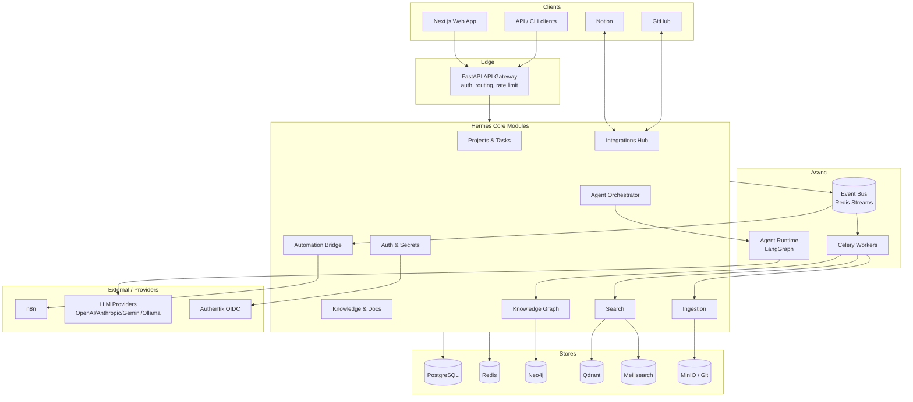
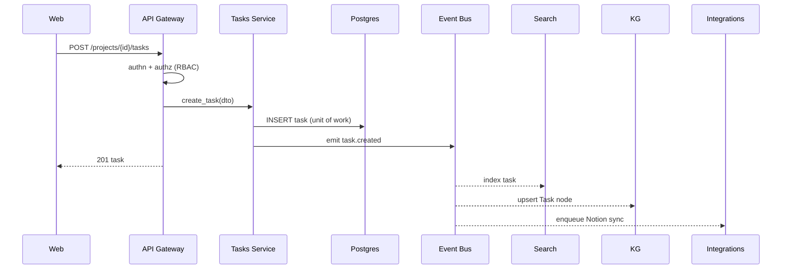
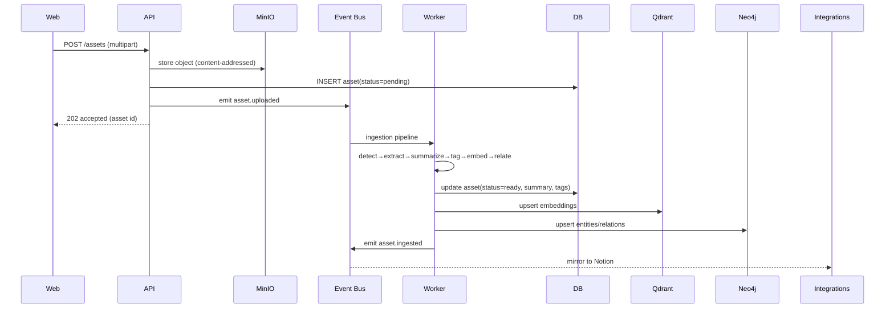
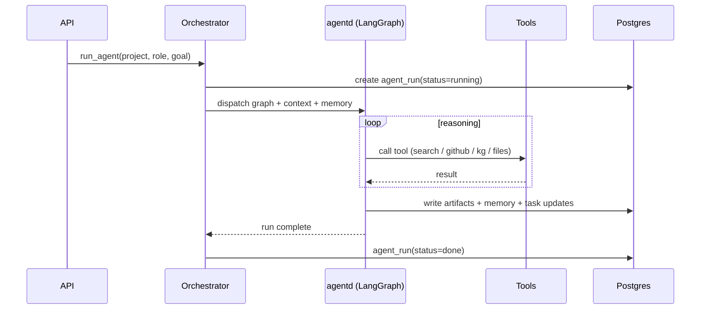

# 03 — System Architecture

## 1. Overview

Hermes is a **modular, service-oriented monolith-of-modules**: a single deployable
core composed of clearly bounded modules, plus a few dedicated services (workers, agent
runtime) and stateful backing stores. This keeps the operational surface small enough
to self-host on one machine, while preserving clean module boundaries so pieces can be
split into independent services later without rewrites.

### Design tenets
- **Hermes DB is the source of record.** All interfaces (Notion, GitHub, web) sync
  *to/from* Postgres, never replace it.
- **Ports & adapters (hexagonal).** Core domain logic depends on interfaces; concrete
  providers (AI, storage, search, integrations) are adapters/plugins (`06`).
- **Async by default.** Anything slow (ingestion, sync, agents, analysis) runs on the
  queue, not in the request path.
- **Event-driven.** Domain events fan out to search indexing, KG updates, workflows,
  and notifications.

## 2. Logical architecture

## 3. Services (deployable units)

| Service | Tech | Responsibility |
|---------|------|----------------|
| **web** | Next.js/React/TS | UI, Auth.js sessions, SSR/RSC, calls the API. |
| **api** | FastAPI (Python) | Gateway + core modules; validates, authorizes, persists, emits events. |
| **worker** | Celery | Async jobs: ingestion, sync, analysis, indexing, KG updates. |
| **agentd** | LangGraph service | Executes agent graphs; tool calls; memory; artifact writes. |
| **scheduler** | Celery beat | Cron jobs: polling syncs, digests, backups. |
| **n8n** | n8n | Visual automation runtime (M11). |

> The `api`, `worker`, `agentd`, and `scheduler` share the same Python domain packages
> (`packages/hermes-core`, `hermes-domain`), differing only in entrypoint. This gives
> module isolation without code duplication.

## 4. Backing stores

| Store | Role |
|-------|------|
| **PostgreSQL** | **Source of record.** Relational domain data, sync state, audit log. |
| **Redis** | Cache, Celery broker/result, event bus (Streams), rate limiting, locks. |
| **Neo4j** | Knowledge graph (entities/relationships), GraphRAG traversal. |
| **Qdrant** | Vector embeddings for semantic search & RAG. |
| **Meilisearch** | Fast keyword/full-text index. |
| **MinIO** | Object storage for files, images, videos, generated assets. |
| **Git** | Source-of-truth mirror for repository content analyzed by DeepWiki. |

See `05-DATABASE_DESIGN` for schemas and how these stay consistent.

## 5. Core modules (inside `api`/`worker`)

Each module has: a **router** (HTTP), a **service** (use-cases), **repositories**
(persistence), **schemas** (Pydantic), and **events** it emits/consumes. Modules never
import another module's repositories directly — they call services or react to events.

- **Auth & Secrets** — sessions, RBAC, encrypted secret vault, audit.
- **Projects & Tasks** — projects, tasks, kanban, roadmap, decisions, meetings.
- **Knowledge & Docs** — documents, versions, backlinks, diagrams, ideas.
- **Ingestion** — upload intake, extraction pipeline orchestration (`13`).
- **Search** — hybrid query, indexing consumers (`12`).
- **Knowledge Graph** — entity/relationship writes, graph queries, GraphRAG (`11`).
- **Agent Orchestrator** — agent CRUD, scheduling, dispatch to `agentd` (`10`).
- **Integrations Hub** — Notion/GitHub adapters + sync engine (`07`, `08`).
- **Automation Bridge** — maps domain events ↔ n8n workflows (`14`).

## 6. Communication flow

### 6.1 Synchronous request (create task)

### 6.2 Asynchronous ingestion (upload file)

### 6.3 Agent run (dynamic team)

## 7. Event model

- **Transport:** Redis Streams (durable, consumer groups) for the internal bus; Celery
  for job execution.
- **Naming:** `domain.entity.action` (e.g. `project.created`, `asset.ingested`,
  `repo.pr.opened`).
- **Envelope:** `{id, type, occurred_at, workspace_id, actor, payload, trace_id}`.
- **Consumers:** search indexer, KG updater, integration syncers, automation bridge,
  notifications. Each consumer is idempotent (dedupe on event `id`).
- **Outbox pattern:** domain writes + event emission are transactionally consistent via
  a Postgres outbox table drained to the bus, so no event is lost on crash.

## 8. Consistency & sync strategy

- **Postgres is authoritative.** Derived stores (Qdrant, Meili, Neo4j) are rebuildable
  projections; a `reindex` job can regenerate them from Postgres + object storage.
- **External sync (Notion/GitHub):** conflict resolution defaults to *Hermes wins*,
  configurable per field; idempotency keys + `sync_state` rows track last-synced
  versions and prevent loops. Detail in `07`/`08`.
- **Degradation:** if a derived store or integration is down, core CRUD still succeeds;
  affected work is re-queued. Turning Notion off is a supported, tested state.

## 9. API surface

- **Style:** REST + JSON over the FastAPI gateway; OpenAPI 3 auto-published.
- **Auth:** Bearer (JWT/session) verified at the gateway; RBAC per resource.
- **Versioning:** `/api/v1/...`; additive changes preferred, breaking changes gated by
  version bump.
- **Realtime:** Server-Sent Events / WebSocket channel for activity feeds, agent
  progress, and search-as-you-type.
- **Webhooks in:** `/webhooks/notion`, `/webhooks/github`, `/webhooks/n8n` (signature
  verified).

## 10. Security architecture (summary)

- **AuthN:** Auth.js (web) + gateway JWT verification; optional Authentik OIDC.
- **AuthZ:** RBAC (workspace/project roles) + resource checks in each service.
- **Secrets:** provider keys encrypted at rest (envelope encryption via a KMS/`age`
  key); never returned in plaintext through the API.
- **Agent least privilege:** each agent gets a scoped tool + permission set per run.
- **Audit:** every sensitive mutation writes an append-only audit record.
- **Transport:** TLS everywhere; signed inbound webhooks; rate limiting at the gateway.

Full detail lives across `03` (here), `05` (audit/secret tables), `06` (provider
isolation), and `10` (agent permissions).

## 11. Deployment topology (self-host)

- **Single-host default:** one `docker-compose.yml` runs web, api, worker, agentd,
  scheduler, n8n, and all stores. Suitable for individuals/small teams.
- **Scale-out (later):** api/worker/agentd scale horizontally; stores externalized to
  managed/replicated instances; optional Helm chart (M12).
- **Config:** 12-factor via env vars; provider selection through the plugin registry.

## 12. Observability (M12)

- **Logs:** structured JSON, correlation via `trace_id`.
- **Metrics:** Prometheus (request rates, queue depth, job latency, agent runs).
- **Tracing:** OpenTelemetry across api → worker → agentd.
- **Dashboards & alerts:** shipped as templates.
