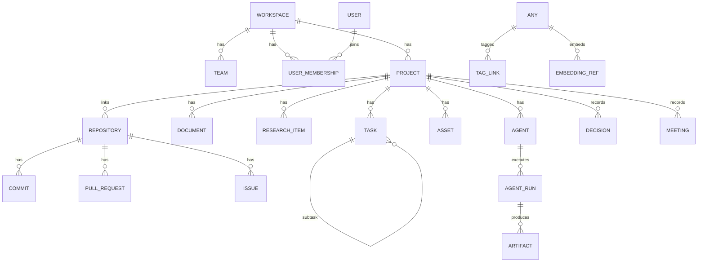

# 05 — Database Design

Hermes uses **four data planes**, each rebuildable from the authoritative one:

1. **PostgreSQL** — the **source of record** (relational domain data).
2. **Neo4j** — the knowledge graph (derived).
3. **Qdrant** — vector embeddings (derived).
4. **Meilisearch** — keyword index (derived).

Object bytes live in **MinIO**; Postgres stores their metadata and pointers.

> **Rule:** Never write authoritative data only to a derived store. Neo4j/Qdrant/Meili
> are projections that a `reindex` job can regenerate from Postgres + MinIO.

---

## 1. PostgreSQL schema

### 1.1 Conventions
- **PK:** `uuid` (`gen_random_uuid()` via `pgcrypto`).
- **Timestamps:** `created_at`, `updated_at` (UTC, trigger-maintained), soft delete via
  `deleted_at` where relevant.
- **Multi-tenancy:** almost every table carries `workspace_id`; row access is scoped by
  it (optionally enforced with Postgres RLS).
- **Extensibility:** a `metadata jsonb` column on major entities for
  plugin/forward-compat data.
- **Enums:** Postgres enum types for stable status vocabularies.

### 1.2 Entity-relationship (core)



### 1.3 Identity, tenancy & access

```
workspaces        (id, name, slug, plan, settings jsonb, created_at, updated_at)
users             (id, email UNIQUE, name, avatar_url, auth_provider, created_at, ...)
teams             (id, workspace_id, name, description)
user_memberships  (id, workspace_id, user_id, team_id?, role, created_at)
                  role ∈ {owner, admin, editor, viewer}
project_members   (id, project_id, user_id, role)  -- resource-level override
api_tokens        (id, workspace_id, user_id, name, token_hash, scopes[], last_used_at)
```

### 1.4 Projects & work management

```
projects   (id, workspace_id, key, name, description, status, visibility,
            lead_user_id?, start_date?, target_date?, metadata jsonb,
            created_at, updated_at, deleted_at?)
           status ∈ {planned, active, paused, done, archived}

tasks      (id, workspace_id, project_id, parent_task_id?, title, description,
            status, priority, assignee_id?, estimate, labels text[],
            due_date?, position numeric, source, external_ref jsonb,
            metadata jsonb, created_at, updated_at, deleted_at?)
           status ∈ {backlog, todo, in_progress, in_review, done, canceled}
           priority ∈ {none, low, medium, high, urgent}
           source ∈ {hermes, github, notion}

task_dependencies (id, task_id, depends_on_task_id, type)  -- blocks/relates
roadmap_items     (id, project_id, title, start_date, end_date, milestone bool, task_id?)
decisions         (id, project_id, title, context, decision, consequences,
                   status, decided_at, author_id)         -- ADR-style
meetings          (id, project_id, title, occurred_at, attendees jsonb,
                   transcript_asset_id?, summary, action_items jsonb)
ideas             (id, workspace_id, project_id?, title, body, status, votes int)
```

### 1.5 Knowledge & documents

```
documents         (id, workspace_id, project_id?, title, slug, kind, status,
                   current_version_id?, source, external_ref jsonb, metadata jsonb, ...)
                  kind ∈ {doc, wiki, spec, note, generated}
document_versions (id, document_id, version int, content_md text, content_hash,
                   author_id?, created_at)                -- full version history
document_links    (id, from_document_id, to_document_id, type)  -- backlinks/refs
diagrams          (id, workspace_id, project_id?, title, kind, source text, format,
                   render_asset_id?)                       -- kind: mermaid|flow|mindmap
```

### 1.6 Repositories (GitHub intelligence)

```
repositories  (id, workspace_id, project_id?, provider, external_id, full_name,
               default_branch, url, private bool, last_synced_at, analysis_status,
               metadata jsonb)
commits       (id, repository_id, sha, author, message, committed_at, stats jsonb,
               analysis jsonb)
pull_requests (id, repository_id, number, title, state, author, branch, base,
               opened_at, merged_at?, analysis jsonb, task_id?)
issues        (id, repository_id, number, title, state, author, labels text[],
               opened_at, closed_at?, task_id?)            -- issue↔task link
repo_files    (id, repository_id, path, language, size, hash, last_commit_sha)
wiki_pages    (id, repository_id, project_id, path, title, content_md, generated bool,
               source_refs jsonb, updated_at)              -- DeepWiki output
```

### 1.7 Files & assets

```
assets   (id, workspace_id, project_id?, kind, filename, mime_type, size_bytes,
          content_hash UNIQUE(workspace_id, content_hash), storage_key,
          status, summary, extracted_text_ref?, metadata jsonb,
          uploaded_by, created_at, ...)
         kind ∈ {file, image, video, audio, archive, repo_snapshot}
         status ∈ {pending, processing, ready, failed}
asset_derivatives (id, asset_id, type, storage_key, metadata jsonb)
                  -- thumbnails, transcripts, page images, extracted pages
```

### 1.8 Tagging, embeddings & relationships (polymorphic)

Rather than per-table tag/embedding tables, Hermes uses a **polymorphic link** keyed by
`(entity_type, entity_id)`:

```
tags          (id, workspace_id, name, color, UNIQUE(workspace_id, name))
tag_links     (id, tag_id, entity_type, entity_id)
embedding_refs(id, workspace_id, entity_type, entity_id, chunk_index,
               qdrant_point_id, model, dims, content_hash, created_at)
graph_refs    (id, workspace_id, entity_type, entity_id, neo4j_node_id, synced_at)
relationships (id, workspace_id, from_type, from_id, to_type, to_id, rel_type,
               weight, source, metadata jsonb)   -- mirror of KG edges (audit/rebuild)
```

`embedding_refs`/`graph_refs` are the bridge that lets Hermes rebuild Qdrant/Neo4j and
keep them consistent with the source of record.

### 1.9 Agents

```
agents        (id, workspace_id, project_id?, role, name, status, config jsonb,
               permissions jsonb, memory_scope, created_at)
              role ∈ {project_manager, research, documentation, developer,
                      code_review, testing, release, custom}
              status ∈ {idle, scheduled, running, disabled}
agent_runs    (id, agent_id, trigger, goal, status, input jsonb, output jsonb,
               tokens_used, cost, started_at, finished_at?, trace_id)
              status ∈ {queued, running, waiting_human, succeeded, failed, canceled}
agent_memory  (id, agent_id, scope, key, value jsonb, importance, embedding_ref_id?,
               created_at, expires_at?)         -- short/long-term memory
agent_messages(id, run_id, from_agent_id?, to_agent_id?, role, content, tool_calls jsonb)
artifacts     (id, run_id, project_id, type, title, storage_key?, document_id?,
               metadata jsonb)                  -- docs, diagrams, code, reports
```

### 1.10 Integrations & sync

```
integrations   (id, workspace_id, provider, status, config jsonb, created_at)
               provider ∈ {notion, github, slack, gdrive, ...}
sync_state     (id, integration_id, entity_type, hermes_id, external_id,
               external_version, last_synced_at, direction, checksum,
               UNIQUE(integration_id, entity_type, hermes_id))
sync_log       (id, integration_id, event, status, detail jsonb, created_at)
webhook_events (id, provider, external_id UNIQUE, payload jsonb, processed bool,
               received_at)                     -- inbound idempotency
```

### 1.11 Automation

```
workflows      (id, workspace_id, name, engine, definition jsonb, enabled bool,
               n8n_workflow_id?, created_at)     -- engine: n8n|native
workflow_runs  (id, workflow_id, trigger_event, status, input jsonb, output jsonb,
               started_at, finished_at?)
```

### 1.12 Security, secrets & audit

```
secrets        (id, workspace_id, name, provider, ciphertext bytea, key_id,
               created_by, created_at, rotated_at?)   -- envelope-encrypted; no plaintext
audit_log      (id, workspace_id, actor_type, actor_id, action, entity_type,
               entity_id, ip, user_agent, before jsonb, after jsonb, created_at)
               -- append-only; actor_type ∈ {user, agent, system, integration}
outbox         (id, aggregate_type, aggregate_id, event_type, payload jsonb,
               published bool, created_at)            -- transactional event outbox
```

### 1.13 Indexing & performance
- B-tree indexes on all FKs and common filters (`workspace_id`, `project_id`,
  `status`, `updated_at`).
- GIN indexes on `labels text[]`, `metadata jsonb`, and Postgres `tsvector` columns for
  fallback full-text.
- Partial indexes for hot paths (e.g. `WHERE deleted_at IS NULL`).
- `content_hash` uniqueness for asset dedup.

---

## 2. Knowledge graph schema (Neo4j)

Property graph mirroring domain entities as nodes and their relationships as edges.

### 2.1 Node labels
`Workspace, Project, Task, Document, Repository, Commit, PullRequest, Issue, Asset,
Person, Agent, Concept, Topic, Technology, Decision, Meeting, Idea`

Each node carries: `hermes_id`, `workspace_id`, `type`, `title/name`, `updated_at`,
plus a subset of properties for traversal/filtering. Bytes/large text stay in
Postgres/MinIO — Neo4j holds structure + lightweight props.

### 2.2 Relationship types
```
(:Project)-[:HAS_TASK]->(:Task)
(:Project)-[:HAS_DOC]->(:Document)
(:Project)-[:LINKS_REPO]->(:Repository)
(:Task)-[:BLOCKS]->(:Task)
(:Document)-[:REFERENCES]->(:Document)
(:Repository)-[:HAS_PR]->(:PullRequest)
(:PullRequest)-[:CLOSES]->(:Issue)
(:Person)-[:AUTHORED]->(:Commit|:Document|:Task)
(:Asset)-[:MENTIONS]->(:Concept|:Technology|:Topic)
(:Document)-[:ABOUT]->(:Concept)
(:Agent)-[:PRODUCED]->(:Artifact)
(:Concept)-[:RELATED_TO {weight}]->(:Concept)
```

### 2.3 Constraints & indexes
```cypher
CREATE CONSTRAINT hermes_id_unique IF NOT EXISTS
  FOR (n:Entity) REQUIRE (n.workspace_id, n.hermes_id) IS UNIQUE;
CREATE INDEX entity_type_idx IF NOT EXISTS FOR (n:Entity) ON (n.type);
```
(Applied per concrete label; `:Entity` shown for brevity.)

### 2.4 Sync
- Written by the KG module reacting to domain events (`*.created/updated/ingested`).
- `graph_refs`/`relationships` in Postgres record what has been synced, enabling
  incremental updates and full rebuilds. See `11-KNOWLEDGE_GRAPH`.

---

## 3. Vector database structure (Qdrant)

### 3.1 Collections
One primary collection, or per-tenant collections for isolation at scale:

```
collection: hermes_embeddings
  vectors: { size: <model dims>, distance: Cosine }
  payload:
    workspace_id: keyword          # filter (permission scoping)
    project_id:   keyword
    entity_type:  keyword          # document|asset|task|commit|research|message
    entity_id:    keyword
    chunk_index:  integer
    title:        text
    snippet:      text
    tags:         keyword[]
    acl:          keyword[]         # role/user ids allowed to see this
    model:        keyword
    created_at:   integer
```

### 3.2 Design notes
- **Chunking:** content is split into overlapping chunks; each chunk → one point.
  `embedding_refs` in Postgres maps chunk → `qdrant_point_id` for rebuilds/deletes.
- **Permission-aware retrieval:** every query filters on `workspace_id` and an ACL
  clause so RAG never leaks across tenants/roles.
- **Multiple models:** `model` payload + `embedding_refs.model` allow migration between
  embedding models (re-embed job) without ambiguity.
- **Hybrid:** Qdrant supplies dense semantic results; Meilisearch supplies lexical;
  fused in the Search module (`12`).

### 3.3 Meilisearch (keyword) index shape
```
index: hermes_content
  primary_key: doc_id            # `${entity_type}:${entity_id}:${chunk?}`
  searchable: [title, body, path, tags]
  filterable: [workspace_id, project_id, entity_type, tags, acl]
  sortable:   [updated_at]
```

---

## 4. Consistency, migrations & rebuilds

- **Migrations:** all Postgres changes via **Alembic**, reversible, reviewed in CI.
  Neo4j constraints and Qdrant/Meili collection setup are versioned as idempotent
  bootstrap scripts.
- **Transactional events:** the `outbox` table guarantees domain write + event are
  atomic; a relay publishes to the bus, so derived stores never miss updates.
- **Reindex/rebuild:** a maintenance job can drop and rebuild Qdrant, Meili, and Neo4j
  entirely from Postgres + MinIO — the definition of "source of record."
- **Deletes:** deleting an entity cascades cleanup to derived stores via
  `embedding_refs`/`graph_refs` and Meili doc ids.
- **Backups (M12):** Postgres (pg_dump/WAL), Neo4j dumps, Qdrant snapshots, MinIO
  replication, on a schedule with a documented restore runbook.
