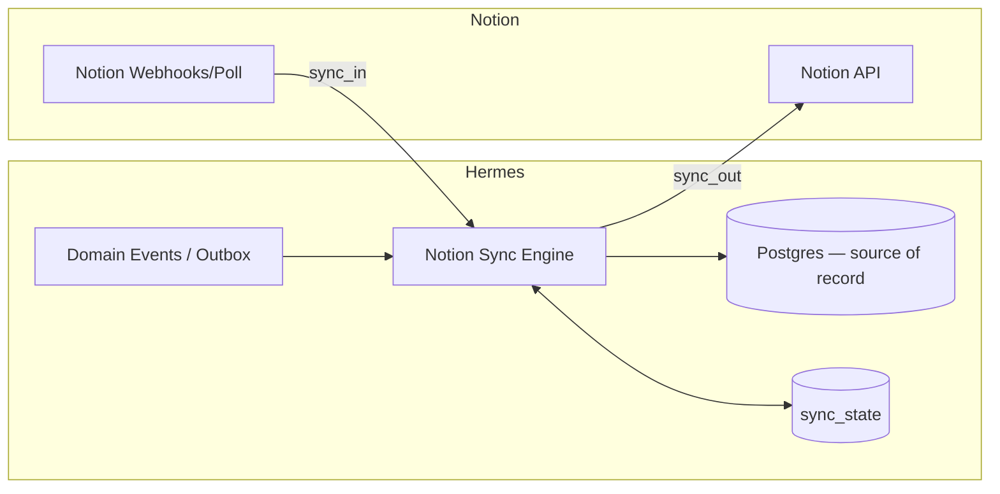

# 07 — Notion Integration

## 1. Role & the golden rule

Notion is a **primary interface** — a human-friendly dashboard, planning, and
collaboration surface. **Notion is NOT the database of record.** Hermes' PostgreSQL is
authoritative; Notion is a *projection with two-way sync*.

> **Golden rule (tested):** If Notion is disconnected, Hermes must keep working
> completely. Notion sync is an optional, degradable feature — never a dependency of
> core CRUD. This is a Milestone 4 exit criterion.

Notion is implemented as an **Integration plugin** (`06`) — the same interface any
integration uses — so it is replaceable and non-special in the core.

## 2. Notion databases (mapped surfaces)

Hermes provisions and syncs these ten Notion databases, each mapped to Hermes entities:

| Notion database | Hermes entity | Key properties synced |
|-----------------|---------------|------------------------|
| **Projects** | `projects` | Name, Status, Lead, Dates, Key, Link-back |
| **Tasks** | `tasks` | Title, Status, Assignee, Priority, Due, Project relation |
| **Research** | `research_items` | Title, Source, Status, Summary, Project relation |
| **Repositories** | `repositories` | Name, URL, Default branch, Project relation |
| **Documents** | `documents` | Title, Kind, Status, Project, Content (page body) |
| **Agents** | `agents` | Name, Role, Status, Project relation |
| **Knowledge** | KG concepts / documents | Title, Type, Related-to relations |
| **Ideas** | `ideas` | Title, Status, Votes, Project |
| **Meetings** | `meetings` | Title, Date, Attendees, Summary, Action items |
| **Assets** | `assets` | Filename, Kind, Summary, Tags, Project |

Each Notion page stores a hidden `hermes_id` property (and Hermes stores the Notion
page id in `sync_state`) to bind the two records.

## 3. Sync architecture

- **Outbound (Hermes → Notion):** domain events (`project.created`, `task.updated`, …)
  drain from the outbox to the Notion sync engine, which upserts the corresponding
  Notion page and records versions in `sync_state`.
- **Inbound (Notion → Hermes):** Notion webhooks (or a polling fallback where webhooks
  aren't available) deliver page changes; the engine translates them to
  `DomainChange`s applied through the normal service layer (so validation, events, and
  further projections all fire).

## 4. Field mapping & transformation

- A declarative **mapping table** per entity defines: Hermes field ↔ Notion property,
  type coercion (e.g. Hermes enum ↔ Notion select), and direction (`out`, `in`,
  `both`, `read_only`).
- **Rich content:** Hermes documents (Markdown) ↔ Notion blocks via a Markdown⇄blocks
  converter; large/binary content stays in Hermes/MinIO with a link in Notion.
- **Relations:** Notion relations are resolved via `sync_state` (external_id ↔
  hermes_id). Unresolved relations are queued until both sides exist.

## 5. Conflict resolution

- **Default policy: Hermes wins.** On conflicting concurrent edits, Hermes' value is
  authoritative; the Notion change is logged and (optionally) surfaced for review.
- **Configurable per field:** a field can be marked `notion_authoritative` (e.g. a
  human-curated description) so inbound changes win for that field only.
- **Detection:** each side tracks a `checksum`/`external_version` in `sync_state`; a
  change is only applied if the incoming version differs from the last synced version.

## 6. Idempotency & loop prevention

- Every inbound webhook is recorded in `webhook_events` (unique `external_id`);
  duplicates are ignored.
- The engine tags its own writes so a Hermes→Notion write doesn't bounce back as a
  Notion→Hermes change (compare against last-written checksum before applying inbound).
- Outbound operations use idempotency keys so retries don't create duplicate pages.

## 7. Rate limits & batching

- Respect Notion API rate limits with a token-bucket limiter and exponential backoff.
- Batch related updates; coalesce rapid successive edits to the same entity before
  pushing.
- All Notion calls run on the worker queue, never in the API request path.

## 8. Setup flow

1. Admin connects Notion via OAuth/integration token (stored in the encrypted vault).
2. Hermes creates (or links to existing) the ten databases in a chosen Notion
   workspace/teamspace, writing the required properties incl. hidden `hermes_id`.
3. Initial backfill: export existing Hermes entities → Notion (and optionally import
   existing Notion pages → Hermes).
4. Enable webhooks/polling; sync goes live.

## 9. Failure & degradation behavior

| Condition | Behavior |
|-----------|----------|
| Notion API down | Core CRUD unaffected; outbound changes queue & retry with backoff. |
| Notion disconnected | Feature disabled; Hermes fully functional; re-sync on reconnect. |
| Webhook missed | Periodic reconciliation poll catches drift via `sync_state` checksums. |
| Mapping error | Logged to `sync_log`, item skipped, surfaced in admin UI; no data loss. |

## 10. Security

- Notion token stored encrypted (`secrets`); never exposed via API.
- Only mapped fields are synced; sensitive fields can be excluded from Notion entirely.
- All sync actions are audited (`audit_log`, actor_type=`integration`).

## 11. Testing (M4)

- **Round-trip tests:** create/update in Hermes → assert Notion; edit in Notion → assert
  Hermes.
- **Conflict tests:** concurrent edits resolve per policy.
- **Idempotency tests:** duplicate webhooks and retried outbound ops don't duplicate.
- **Disconnect test (headline):** disable Notion → run the full core test suite → all
  green.
