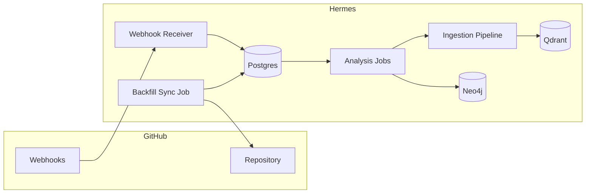

# 08 — GitHub Integration

## 1. Role

GitHub remains the **source of truth for code**. Hermes **indexes and augments** it:
mirroring repository metadata, analyzing commits/PRs/issues, feeding the ingestion
pipeline, powering DeepWiki (`09`), and linking everything into projects, search, and
the knowledge graph. Implemented as an **Integration plugin** (`06`).

## 2. Capabilities

- **Repository syncing** — link repos to projects; mirror metadata, branches, files.
- **Commit analysis** — summarize changes, detect touched modules, update the graph.
- **Issue tracking** — bidirectional Issue ↔ Task sync.
- **Pull request analysis** — summarize PRs, risk/size signals, link to tasks/docs.
- **Documentation generation** — trigger DeepWiki wiki/architecture updates on change.

## 3. Connection & auth

- **GitHub App** (preferred) for fine-grained, per-repo permissions and webhooks; or a
  personal/OAuth token for simple self-host.
- Credentials stored in the encrypted secret vault (`05` `secrets`).
- Least privilege: read repo contents/metadata/issues/PRs; write only where explicitly
  enabled (e.g. creating an issue from a task).

## 4. Data model

Maps to `repositories`, `commits`, `pull_requests`, `issues`, `repo_files`, and
`wiki_pages` (see `05`). `sync_state` tracks external ids and versions; Issue↔Task and
PR↔Task links live on `issues.task_id` / `pull_requests.task_id`.

## 5. Sync architecture

- **Backfill:** on link, a job clones/reads the repo (via API or shallow git mirror),
  records files, recent commits, open issues/PRs, and kicks off DeepWiki analysis.
- **Live updates:** webhooks (`push`, `pull_request`, `issues`, `issue_comment`,
  `release`) are verified (signature), recorded in `webhook_events` (idempotent), and
  fan out to analysis + ingestion + KG updates.
- **Reconciliation:** periodic poll compares `sync_state` to catch missed webhooks.

## 6. Commit analysis

On `push`:
1. Fetch commit metadata + diff stats.
2. Detect changed files/modules/languages; map to `repo_files` and architecture nodes.
3. AI summary of the change (what/why/impact) stored in `commits.analysis`.
4. Update KG (`Person -[:AUTHORED]-> Commit -[:TOUCHED]-> Module`).
5. If significant paths changed, enqueue DeepWiki update (`09`).

## 7. Pull request analysis

On `pull_request` (opened/updated/merged):
- Summarize intent and changes; compute size/risk signals (files, additions, hotspots).
- Link to related task(s) via branch/issue references (`Closes #123` → task).
- Store in `pull_requests.analysis`; surface in the project activity feed.
- On merge, optionally transition linked task to `done` and trigger release-note
  workflow (`14`).

## 8. Issue ↔ Task sync

- **Inbound:** new/updated GitHub issue → create/update Hermes task (`source=github`,
  `issues.task_id` linked). Labels/assignee/state mapped.
- **Outbound:** creating a Hermes task with "sync to GitHub" enabled opens an issue;
  status changes propagate.
- **Conflict policy:** configurable; default *Hermes wins* except issue `state`, which
  can be GitHub-authoritative. Loop prevention mirrors the Notion approach (`07`).

## 9. Documentation generation (DeepWiki hook)

Repository changes trigger DeepWiki jobs (`09`) that regenerate/refresh:
- Architecture overview & diagrams (Mermaid).
- Per-module documentation.
- Dependency map.
- "Ask this repo" embeddings (via ingestion → Qdrant).

Generated `wiki_pages` are versioned and linked from the project's DeepWiki view.

## 10. Repository content ingestion

Source files and READMEs flow through the **file ingestion pipeline** (`13`) with a
repo-aware extractor: language detection, symbol/outline extraction, chunking by
file/function, embeddings for code search, and KG entities for modules/technologies.
This powers code search and grounded repo Q&A.

## 11. Security

- Webhook signatures verified; payloads treated as untrusted input.
- Tokens encrypted, scoped, rotatable; per-repo access via GitHub App installation.
- All sync/analysis actions audited (`audit_log`).
- Rate limiting + backoff to respect GitHub API quotas; all heavy work on the queue.

## 12. Testing (M5)

- Backfill produces repo, files, issues, PRs in Hermes.
- Simulated webhooks create/update commits, PRs, issues idempotently.
- Issue↔Task round-trip with conflict-policy tests.
- Commit push triggers analysis + DeepWiki refresh.
