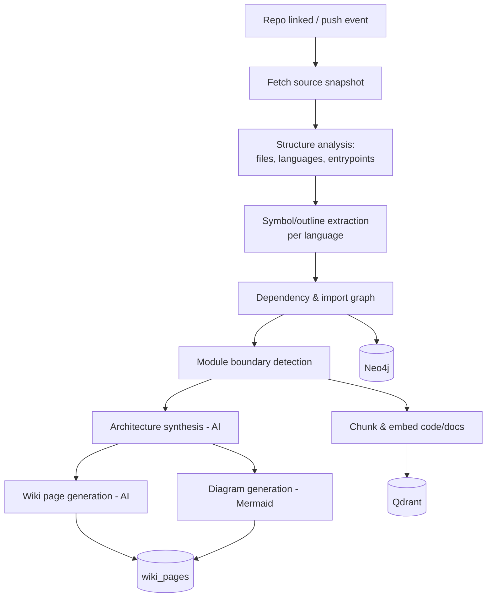

# 09 — DeepWiki System (Repository Intelligence)

## 1. Purpose

DeepWiki turns a linked repository into **living, auto-generated documentation**: an
architecture overview, per-module docs, dependency maps, diagrams, and a grounded
"Ask this repo" experience — all kept up to date as the code changes.

Inspired by DeepWiki; built on Hermes' ingestion (`13`), search (`12`), knowledge graph
(`11`), and agents (`10`).

## 2. What it produces

| Output | Stored as | Surface |
|--------|-----------|---------|
| Architecture overview | `wiki_pages` (generated) | Project → Architecture |
| Module/package docs | `wiki_pages` | Project → DeepWiki |
| Dependency map | `diagrams` (mermaid) + graph | Project → Architecture |
| Component diagrams | `diagrams` (mermaid/flow) | DeepWiki / Docs |
| "Ask this repo" index | embeddings (Qdrant) + KG | AI Assistant / Search |
| Changelog/summaries | `wiki_pages`, commit/PR analysis | Timeline / Activity |

## 3. Analysis pipeline

### Steps
1. **Fetch snapshot** — shallow git mirror or API tree of the default branch (or a
   PR/tag). Content-addressed so unchanged files are skipped on refresh.
2. **Structure analysis** — inventory files, detect languages, entrypoints, build/config
   files, test dirs.
3. **Symbol extraction** — per-language parsers/heuristics extract modules, classes,
   functions, exports, and docstrings (tree-sitter-style approach; pluggable per
   language via the Extractor interface).
4. **Dependency graph** — resolve imports/requires into an internal module dependency
   graph; detect external dependencies (package manifests).
5. **Module boundaries** — cluster files into logical modules/components.
6. **Architecture synthesis (AI)** — an agent summarizes the system: purpose, major
   components, data flow, key decisions, and how modules interact — grounded in the
   extracted structure (not hallucinated).
7. **Diagram generation** — emit Mermaid for architecture, component, and dependency
   diagrams; store as `diagrams` + render to assets.
8. **Wiki generation** — generate per-module and overview `wiki_pages` with links to
   files/symbols and citations.
9. **Indexing** — chunk and embed code + generated docs into Qdrant; write module/tech
   entities and relationships into Neo4j for GraphRAG.

## 4. Grounding & citations

- Generated content **cites source files/symbols** (path + line ranges) so users can
  verify. Pages store `source_refs` (jsonb) mapping claims → code locations.
- The architecture agent is constrained to the extracted facts (structure, deps,
  symbols) + retrieved code chunks — reducing hallucination and keeping docs faithful.

## 5. Incremental updates

On a `push`/PR event (`08`):
- Diff determines which files/modules changed.
- Only affected symbols, embeddings, dependency edges, and wiki pages are recomputed.
- Architecture overview is refreshed only when structural changes (new modules, changed
  deps) are detected — cheap edits don't trigger full regeneration.
- Each `wiki_pages` update is versioned; the Timeline shows what changed and why.

## 6. "Ask this repo"

- A repo-scoped GraphRAG query: retrieve relevant code chunks (Qdrant, filtered to the
  repo) + traverse the module graph (Neo4j) → answer with citations.
- Available in the AI Assistant and per-project search; also callable as an **agent
  tool** (`10`) so the Developer/Review agents can reason about the codebase.

## 7. Multi-language support

Language handling is pluggable (Extractor plugins, `06`). Initial targets: Python,
TypeScript/JavaScript, Go, Java, plus Markdown/docs. Unknown languages still get
file-level structure, embeddings, and doc summaries — degrading gracefully.

## 8. Agents involved

DeepWiki is largely powered by the project's **Documentation Agent** and a
repo-analysis capability of the **Developer/Code Review Agents** (`10`), coordinated by
the orchestrator. Generation runs as ephemeral agent runs, not always-on processes.

## 9. Quality & safety

- **Determinism where possible:** structural facts come from parsers, not the model.
- **Faithfulness checks:** generated claims are linked to sources; a review step can
  flag unsupported statements.
- **Idempotent & resumable:** analysis jobs are queued, retriable, and content-addressed
  to avoid duplicate work.
- **Cost control:** incremental updates + caching keep token usage bounded.

## 10. Testing (M5/M9)

- Fixture repos produce expected module/dependency graphs.
- Architecture synthesis cites real files; no orphan claims.
- Incremental update only touches changed modules.
- "Ask this repo" returns grounded answers with citations on a known fixture.
