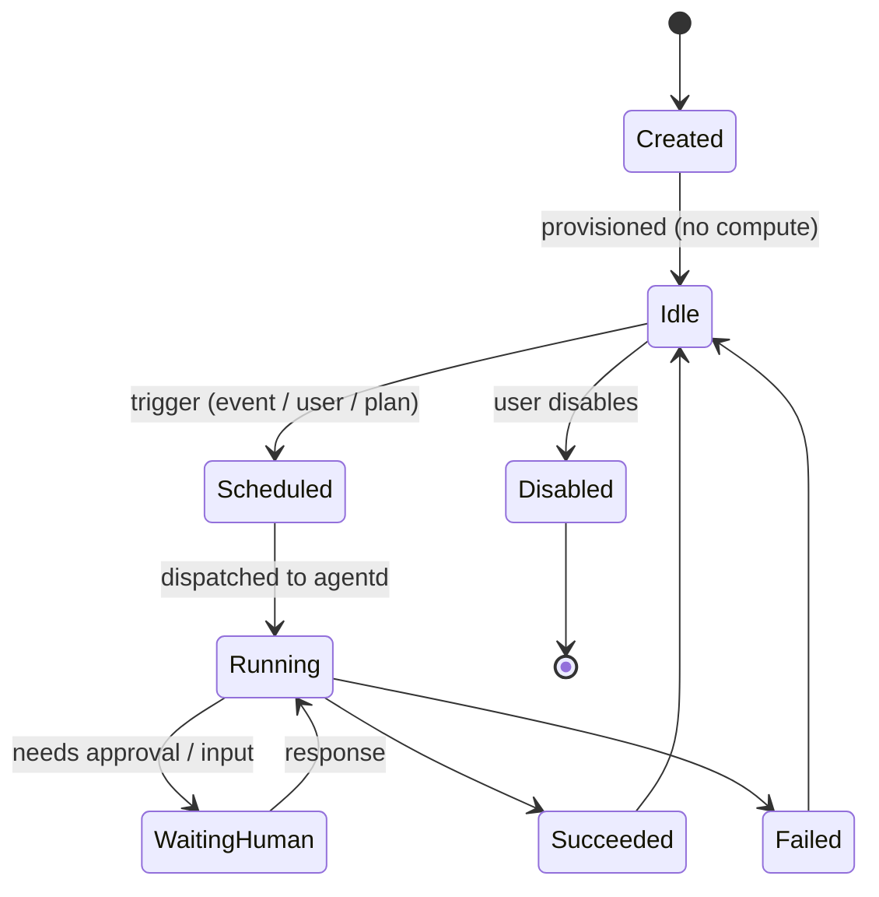
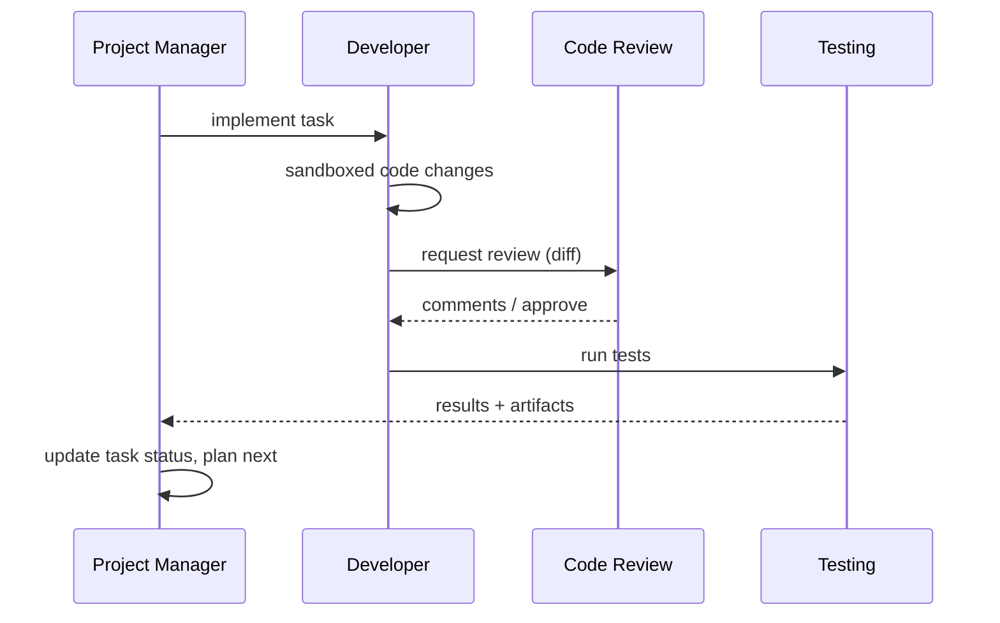

# 10 — Agent System

## 1. Philosophy

Hermes agents are **dynamic and ephemeral**. They are created for a purpose, run to
accomplish a goal, and then go idle or are torn down. **No unnecessary always-on
agents.** Agents communicate, share memory, use tools, update tasks, and produce
artifacts.

Built on **LangGraph** (explicit stateful graphs, cycles, checkpoints, human-in-the-
loop) executed by the `agentd` service (`03`), with model access through the **AI
Provider plugin** (`06`) so any provider (OpenAI/Anthropic/Gemini/Ollama) works.

## 2. Agent roles (default project team)

Creating a software project provisions this team (idle until invoked):

| Agent | Responsibility |
|-------|----------------|
| **Project Manager** | Plans, breaks down goals into tasks, coordinates other agents, updates roadmap/kanban. |
| **Research** | Gathers/summarizes information, fills the research queue, cites sources. |
| **Documentation** | Generates/maintains docs & DeepWiki content. |
| **Developer** | Reads/writes code, proposes changes, uses repo tools (sandboxed). |
| **Code Review** | Reviews diffs/PRs for correctness, style, risk. |
| **Testing** | Generates/runs tests, reports results. |
| **Release** | Prepares release notes, coordinates release steps. |

Additional/custom agents can be defined; templates live in config and are extensible.

## 3. Agent lifecycle

- **Created/Idle:** exists as a row (`agents`), consumes no compute.
- **Scheduled:** a trigger (domain event, user action, or PM plan) enqueues a run.
- **Running:** `agentd` executes the LangGraph; produces `agent_runs`, `agent_messages`,
  `artifacts`, and memory writes.
- **WaitingHuman:** human-in-the-loop checkpoint for approvals (e.g. writing code,
  external actions).
- **Terminal → Idle:** on completion the agent returns to idle; no lingering process.

Triggers are event-driven (e.g. `repo.pr.opened` → Code Review agent) or plan-driven
(PM decomposes a goal and schedules sub-agents).

## 4. Agent memory

Three tiers (`agent_memory`, `05`):

- **Working memory** — the current run's context/state (LangGraph state; ephemeral).
- **Short-term memory** — recent run outcomes, scoped to agent/project; time-boxed
  (`expires_at`).
- **Long-term memory** — durable facts/preferences/learnings; embedded (linked via
  `embedding_ref_id`) and retrieved semantically.

Shared memory: agents on a project can read a shared **project memory scope** (e.g. the
PM's plan, decisions, glossary), enabling coordination without tight coupling. Memory
importance scoring governs retention/eviction.

## 5. Agent permissions

Each agent/run carries an explicit **permission set** (`agents.permissions`), enforced
by the tool layer:

- **Data scope:** which workspaces/projects/entities it can read/write.
- **Tools:** the allowlist of tools it may call.
- **External actions:** whether it may act on GitHub/Notion/etc., and whether such
  actions require human approval.
- **Budget:** token/cost/time limits per run.

Principle of **least privilege**: e.g. the Research agent gets read + web/ingest tools
but no code-write or external-write; the Developer agent gets sandboxed repo tools but
external pushes require approval. All privileged actions are audited.

## 6. Agent tools

Tools are the agent's hands. Exposed via a **tool registry** and (optionally) **MCP**
(`04`), so external MCP servers and Hermes-native tools share one interface.

Core tool categories:
- **Search** — hybrid/GraphRAG queries over the workspace (`12`).
- **Knowledge Graph** — traverse/query relationships (`11`).
- **Projects/Tasks** — create/update tasks, roadmap, decisions.
- **GitHub** — read repo, issues, PRs; write (gated) (`08`).
- **Files** — read/ingest assets; produce documents/diagrams (`13`).
- **Notion** — read/write mapped surfaces (gated) (`07`).
- **Code (Developer)** — sandboxed read/edit/run in an isolated workspace (OpenHands-
  style), never on the host.

Each tool declares a typed schema, permission requirement, and whether it's mutating
(mutating + external tools can require approval).

## 7. Agent communication

- **Message passing:** agents exchange structured messages (`agent_messages`) — e.g. PM
  assigns a subtask to the Developer agent; Developer requests a review from Code
  Review.
- **Shared blackboard:** the project memory scope acts as a shared context all team
  agents can consult.
- **Orchestration:** the **Orchestrator** (`03`) supervises multi-agent runs — a
  LangGraph "supervisor" pattern where the PM (or a supervisor graph) routes work to
  specialist agents and aggregates results.

## 8. Artifacts

Agents produce **artifacts** (`artifacts`, `05`): documents, diagrams, code changes,
research reports, test results, release notes. Artifacts link back to the run and
project, are indexed for search, and can be mirrored to Notion. Nothing an agent does is
invisible — every run has a trace, messages, and artifacts.

## 9. Orchestration engine (LangGraph)

- **Graphs as programs:** each agent/team is a graph with typed state, nodes (reason,
  tool-call, route), and edges (including cycles for iterate-until-done).
- **Checkpoints:** run state is checkpointed so runs are resumable and support
  human-in-the-loop pauses.
- **Determinism & tracing:** every step (`trace_id`) is logged for observability and
  debugging (`agent_messages`, tokens, cost).
- **Provider-agnostic:** the reasoning model is resolved via the AI plugin per
  agent/run.

## 10. Cost, safety & guardrails

- **Ephemeral by design:** no idle compute; runs are bounded by budget/time.
- **Approval gates:** mutating/external actions can require human sign-off.
- **Sandboxing:** code execution runs in isolated containers, not the host; no ambient
  credentials.
- **Auditability:** all agent actions recorded in `audit_log` (actor_type=`agent`).
- **Guarded tools:** tool inputs/outputs validated; secrets never exposed to the model.
- **Rate/loop limits:** max steps/iterations per graph prevent runaway loops.

## 11. Creating agents

- **Automatic:** project creation instantiates the default team (idle).
- **Manual:** users define custom agents (role, tools, permissions, model, memory
  scope) via UI/API.
- **From templates:** role templates encode sensible defaults; workspaces can customize.

## 12. Testing (M9)

- Lifecycle transitions and ephemerality (no idle compute) verified.
- Permission enforcement: an agent cannot call a tool outside its allowlist.
- Memory read/write and sharing across a project team.
- Multi-agent flow on a fixture project produces expected artifacts and task updates.
- Human-in-the-loop pause/resume works; budgets/limits enforced.
