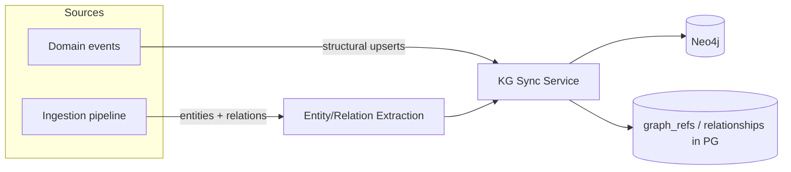
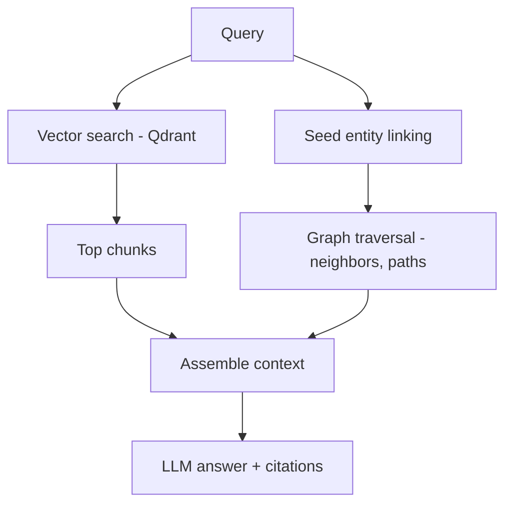

# 11 — Knowledge Graph

## 1. Purpose

The knowledge graph is Hermes' **model of meaning**: it connects every entity —
projects, tasks, documents, repositories, commits, people, assets, concepts,
technologies — into a navigable web of relationships. It powers the Obsidian-style graph
explorer, cross-entity reasoning, and **GraphRAG** (graph-augmented retrieval for the AI
assistant and agents).

Backed by **Neo4j** (property graph, `04`/`05`). The graph is a **derived projection**
of the Postgres source of record plus extraction outputs — always rebuildable.

## 2. Entities (nodes)

Domain nodes mirror Hermes entities (`Project, Task, Document, Repository, Commit,
PullRequest, Issue, Asset, Person, Agent, Meeting, Decision, Idea`) plus **semantic
nodes** discovered during ingestion:

- **Concept** — an idea/entity mentioned across content (e.g. "vector database").
- **Topic** — a broader theme grouping concepts.
- **Technology** — tools/languages/frameworks detected in code, docs, files.

Every node stores `hermes_id`, `workspace_id`, `type`, a display name/title,
`updated_at`, and lightweight, traversal-relevant properties. Heavy text/bytes stay in
Postgres/MinIO.

## 3. Relationships (edges)

Structural (from domain data) and semantic (from extraction):

```
Structural:
  (Project)-[:HAS_TASK|HAS_DOC|LINKS_REPO|HAS_ASSET]->(...)
  (Task)-[:BLOCKS|RELATES_TO]->(Task)
  (Repository)-[:HAS_PR|HAS_ISSUE|HAS_COMMIT]->(...)
  (PullRequest)-[:CLOSES]->(Issue)
  (Person)-[:AUTHORED]->(Commit|Document|Task)
  (Agent)-[:PRODUCED]->(Artifact)
Semantic:
  (Document|Asset|Commit)-[:MENTIONS]->(Concept|Technology|Topic)
  (Document)-[:ABOUT]->(Concept)
  (Concept)-[:RELATED_TO {weight}]->(Concept)
  (Technology)-[:USED_IN]->(Repository|Project)
```

Edges carry properties: `weight`/confidence, `source` (which extraction/event created
it), and timestamps — enabling ranking and provenance.

## 4. How the graph is built



- **Structural sync:** domain events (`project.created`, `task.updated`,
  `repo.pr.opened`, …) upsert nodes/edges directly (deterministic).
- **Semantic extraction (during ingestion, `13`):** named entities, concepts, and
  technologies are extracted from text/code, resolved/deduplicated, and linked with
  confidence weights.
- **Bridge tables:** `graph_refs` and `relationships` (Postgres, `05`) record what's in
  the graph, enabling incremental sync, dedup, and full rebuilds.

## 5. Entity resolution

- **Canonicalization:** concepts/technologies are normalized (aliases → canonical node)
  using a combination of string matching, embeddings similarity, and a curated
  synonym/tech dictionary.
- **Dedup:** before creating a semantic node, search existing nodes (by name +
  embedding) to merge rather than duplicate.
- **Confidence:** low-confidence links are stored with low weight and can be pruned or
  promoted as more evidence accumulates.

## 6. Graph queries

- **Cypher** for expressive traversals (paths, neighborhoods, shortest paths, centrality
  for "important" nodes).
- A **Graph Query API** exposes safe, parameterized queries (no raw Cypher from
  clients): neighbors-of, path-between, subgraph-around, top-related.
- **Permission-aware:** all queries are scoped by `workspace_id` and filtered to the
  caller's accessible projects.

Example (neighborhood for the graph explorer):
```cypher
MATCH (n {hermes_id:$id, workspace_id:$ws})-[r]-(m)
RETURN n, r, m LIMIT $limit
```

## 7. GraphRAG

GraphRAG combines **vector retrieval** (Qdrant) with **graph traversal** (Neo4j) for
richer, more accurate answers than either alone:



1. **Vector step:** semantically retrieve the most relevant chunks.
2. **Graph step:** link the query and top chunks to graph nodes, then traverse to pull
   in structurally related context (e.g. the module a file belongs to, the project a doc
   is in, related concepts).
3. **Assembly:** merge and rank vector + graph context; deduplicate.
4. **Generation:** the LLM answers grounded in the assembled context, with citations to
   source entities.

This is the retrieval backbone for the **AI Assistant** and **agent reasoning** (`10`),
and for "Ask this repo" (`09`).

## 8. Visualization

- The web app renders neighborhoods/subgraphs with **React Flow** (`15`): nodes colored
  by type, edges labeled by relation, expandable on click.
- Per-project and global graph views; filters by entity type, tag, time.
- Clicking a node deep-links to the underlying entity.

## 9. Consistency & rebuilds

- Neo4j is a projection: a `rebuild-graph` job regenerates it from Postgres +
  `relationships`/`graph_refs` + re-running extraction where needed.
- Deletes cascade: removing an entity removes its nodes/edges (via `graph_refs`).
- Idempotent upserts (keyed on `hermes_id`) make sync safe to retry.

## 10. Testing (M8)

- Structural events produce expected nodes/edges.
- Extraction links documents/code to concepts/technologies with dedup (no duplicate
  concept nodes).
- Graph API returns correct, permission-scoped neighborhoods.
- GraphRAG outperforms vector-only on a fixture Q&A set and cites sources.
- Rebuild reproduces the graph from Postgres.
