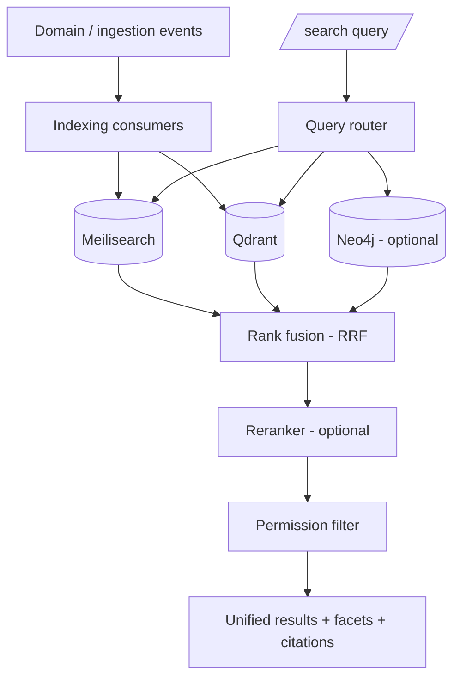

# 12 — Search System

## 1. Purpose

One search box that answers across **everything**: Notion-synced content, GitHub
(code/issues/PRs), files, PDFs, documentation, research, and conversations. Search
combines **semantic** (vector) and **keyword** (lexical) retrieval, is
**permission-aware**, and returns clickable, cited results.

## 2. Retrieval modes & engines

| Mode | Engine | Strength |
|------|--------|----------|
| **Keyword / full-text** | Meilisearch | Exact terms, typo-tolerance, filters, speed. |
| **Semantic** | Qdrant | Meaning-based recall, paraphrase, cross-lingual. |
| **Relational** | Neo4j | Structurally related context (GraphRAG, `11`). |

The Search module **fuses** keyword + semantic (and optionally graph) into a single
ranked list.

## 3. Architecture

## 4. Indexing

- **Event-driven:** create/update/ingest events enqueue indexing jobs; deletes remove
  documents from both engines (via `embedding_refs`/Meili ids).
- **Chunking:** long content is chunked (with overlap) for embeddings; keyword index
  holds both document- and chunk-level records for precise highlighting.
- **What gets indexed:** documents, wiki pages, tasks, research items, assets (extracted
  text), commits/PRs/issues, agent artifacts, and conversation messages.
- **Payload:** `workspace_id`, `project_id`, `entity_type`, `tags`, `acl`, `updated_at`
  (see `05` §3) — the basis for filtering and facets.
- **Idempotent & rebuildable:** indices are projections; a `reindex` job regenerates
  both from Postgres + MinIO.

## 5. Query pipeline

1. **Parse & route** — detect filters (project, type, tags, date), decide modes.
2. **Keyword search** — Meilisearch with filters + typo tolerance + highlights.
3. **Semantic search** — embed the query, Qdrant ANN search with the same filters
   (incl. `acl`).
4. **Fusion** — combine result sets with **Reciprocal Rank Fusion (RRF)** (robust,
   parameter-light), boosting items that rank well in both.
5. **Rerank (optional)** — a cross-encoder/LLM reranker (via AI plugin) reorders the top
   N for precision when enabled.
6. **Permission filter** — final ACL check against the caller's roles/projects (defense
   in depth on top of index-level `acl`).
7. **Assemble** — group by source, attach snippets/highlights, facets, and provenance.

## 6. Hybrid ranking detail

- **RRF:** `score(d) = Σ 1/(k + rank_i(d))` across engines — no need to calibrate
  disparate score scales.
- **Signals/boosts:** recency (`updated_at`), entity type weighting, tag/project match,
  and (optionally) graph centrality from the KG.
- **Tunable:** weights are configurable per workspace; defaults chosen for balanced
  precision/recall.

## 7. Permission-aware search

- Every indexed record carries an `acl` payload (roles/users allowed to see it).
- Queries always inject `workspace_id` + an `acl` filter, so results never leak across
  tenants or beyond a user's access — enforced at the engine level **and** re-checked
  post-fusion.
- Agent searches use the agent's scoped permissions (`10`).

## 8. Search API & UX

- `GET /api/v1/search?q=...&type=...&project=...&mode=hybrid` → unified results with
  facets, highlights, and pagination.
- **Realtime:** search-as-you-type via the SSE/WebSocket channel; keyword results
  stream instantly, semantic results fill in.
- **Facets:** by source (Notion/GitHub/files/docs/research/conversations), project,
  type, tag, date.
- **Answers:** an optional "answer" mode runs GraphRAG (`11`) to synthesize a cited
  answer above the raw results (the AI Assistant path).

## 9. Performance

- **Targets:** keyword P95 < 150 ms; hybrid P95 < 500 ms at 100k items (NFR, `02`).
- **Techniques:** filters push down to engines; ANN params tuned for latency/recall;
  reranking limited to top-N; results cached per (query, filters, acl) for short TTL.

## 10. Failure & degradation

- If Qdrant is unavailable → keyword-only results (flagged as degraded).
- If Meilisearch is unavailable → semantic-only results.
- If reranker is unavailable → RRF order is returned.
Search never hard-fails when one engine is down.

## 11. Testing (M7)

- Relevance suite (golden queries) for keyword, semantic, and hybrid.
- Permission tests: users only see permitted results (index + post-filter).
- Fusion correctness (RRF) and degradation paths.
- Latency benchmarks against targets on a seeded corpus.
