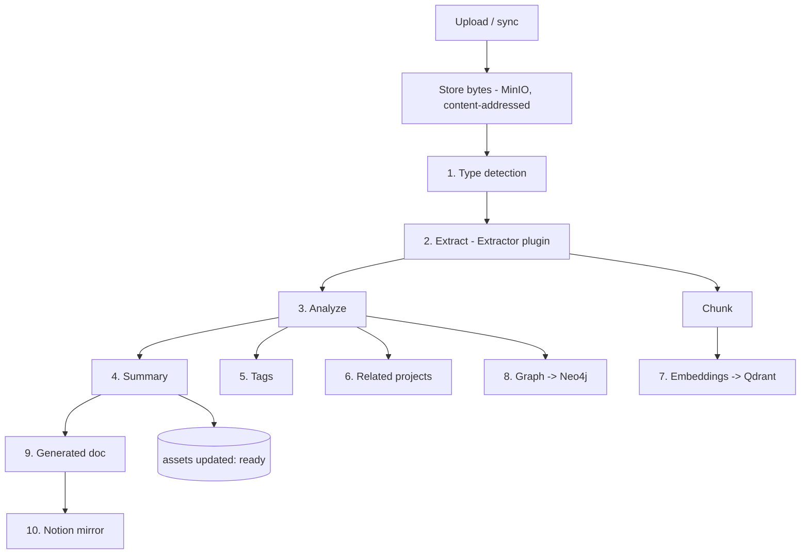

# 13 — File Ingestion

## 1. Purpose

Turn any uploaded or synced file into **structured, searchable, connected knowledge**,
automatically. The pipeline is the backbone of File Intelligence (`02` §10), Search
(`12`), the Knowledge Graph (`11`), and DeepWiki (`09`).

Supported inputs: **PDF, DOCX, ZIP, images, videos, repositories, Markdown** — extensible
via **Extractor plugins** (`06`).

## 2. The automatic pipeline

When a user uploads a file (or a file arrives via GitHub/Notion/GDrive), the system:

1. **Identify file type** — MIME + magic-byte detection (don't trust extensions).
2. **Extract content** — route to the right Extractor; get text + metadata +
   derivatives.
3. **Analyze content** — structure, language, key entities.
4. **Generate summary** — concise AI summary (+ optional long abstract).
5. **Generate tags** — topical tags/keywords.
6. **Detect related projects** — link to likely project(s) via similarity + rules.
7. **Store embeddings** — chunk + embed into Qdrant.
8. **Update knowledge graph** — entities/relations into Neo4j (`11`).
9. **Create documentation** — a generated document/summary page for the asset.
10. **Update Notion** — mirror the asset + summary to the Notion Assets DB (`07`).

The pipeline is **asynchronous** (Celery), **idempotent**, **resumable**, and
**observable** (each step logged, `trace_id`). The asset row moves
`pending → processing → ready|failed`; partial failures re-queue the failed step.

## 3. Storage & deduplication

- Bytes go to **MinIO** via the Storage plugin; keyed by **content hash**
  (`assets.content_hash`), so identical uploads dedupe automatically.
- Derivatives (thumbnails, page images, transcripts, extracted pages) stored as
  `asset_derivatives` (`05`).
- Provenance recorded: who/what uploaded it, source integration, original filename.

## 4. Extractors (per type)

| Type | Extraction |
|------|------------|
| **PDF** | Text + layout; OCR for scanned pages (fallback); page images; tables. |
| **DOCX** | Text, headings, tables, embedded images. |
| **Markdown** | Text + structure; preserved as first-class document content. |
| **Images** | Caption/description (vision model) + OCR text; EXIF metadata. |
| **Video** | Transcript (speech-to-text) + keyframes; optional scene summary. |
| **Audio** | Transcript (speech-to-text). |
| **ZIP/archives** | Unpack; recursively ingest contained files. |
| **Repositories** | Repo-aware extraction (structure, symbols, code chunks) → feeds DeepWiki (`09`). |

Extractors implement the `Extractor` interface (`can_handle`, `extract`), so new
formats/languages are added without touching the pipeline. Vision/STT models are
accessed via the AI plugin (hosted or local/Ollama-Whisper).

## 5. Chunking & embeddings

- Content is split into overlapping chunks sized to the embedding model's context.
- Code is chunked by file/symbol; prose by semantic/paragraph boundaries.
- Each chunk → one Qdrant point; `embedding_refs` (`05`) maps chunk → point for
  rebuild/delete and model migration.
- Embedding model is pluggable per workspace (`06`); re-embed job handles model changes.

## 6. Analysis outputs

- **Summary** (short + optional long) → `assets.summary` and a generated document.
- **Tags** → `tags` + `tag_links`.
- **Entities/relationships** → Neo4j via the KG sync (`11`).
- **Related projects** → link the asset to project(s) (similarity to project content +
  explicit rules like upload context).
- **Documentation** → a `documents` record (kind=`generated`) summarizing the asset,
  linked and searchable.

## 7. Security & safety

- **Untrusted input:** files are treated as hostile — sandboxed extraction, resource
  limits, timeouts.
- **Type/size guards:** allowlist of types, max sizes, archive-bomb protection (limit
  unpack depth/size).
- **Malware scanning hook:** pluggable AV scan before processing (configurable).
- **No host execution:** repo/code extraction parses, it does not execute uploaded code.
- **Audit:** ingestion actions recorded (`audit_log`).

## 8. Reliability

- Every step is a retriable Celery task; failures don't lose the asset (bytes already
  stored) and are surfaced with a clear status.
- Content-addressing + step-level idempotency make re-runs safe.
- Large files stream to storage; heavy extraction runs off the request path.
- Reprocessing: an asset can be re-ingested (e.g. after adding a new extractor or
  changing the embedding model).

## 9. Events emitted

`asset.uploaded` → `asset.processing` → `asset.ingested` (or `asset.failed`). Consumers:
search indexer, KG updater, Notion mirror, notifications, and any workflow triggers
(`14`).

## 10. Testing (M6)

- Each extractor on fixture files yields expected text/derivatives.
- Full-pipeline test: upload a PDF → summary, tags, embeddings, KG links, generated doc,
  Notion mirror.
- Dedup: identical uploads share storage and don't double-index.
- Failure injection: a failing step re-queues without data loss; status reflects it.
- Safety: oversized/malformed/archive-bomb inputs are rejected gracefully.
