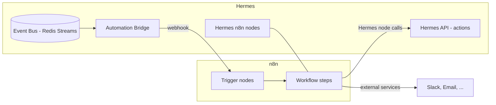

# 14 — Workflow / Automation System

## 1. Purpose

Let users automate work across Hermes and external tools without code: "when X happens,
do Y." Built on **n8n** (mature, self-hostable, 400+ integrations) for the visual
builder, bridged to Hermes' **native event bus** so domain events can trigger workflows
and workflows can act on Hermes data.

## 2. Two layers

| Layer | Role |
|-------|------|
| **Native triggers/actions** | Hermes emits domain events and exposes actions (create task, generate doc, run agent). Lightweight built-in automations can run without n8n. |
| **n8n workflows** | Visual, multi-step automations with branching, external services, schedules — for anything beyond simple rules. |

Simple rules (single trigger → single action) can run natively for speed; complex or
cross-service flows use n8n.

## 3. Architecture

- **Bridge (Hermes → n8n):** the Automation Bridge subscribes to the event bus and
  forwards subscribed events to n8n via webhooks (signed). Event → workflow bindings are
  stored in `workflows` (`05`).
- **Hermes n8n nodes (n8n → Hermes):** custom nodes let workflows call Hermes actions
  (create/update task, add research, generate doc/diagram, run agent, search, update
  Notion) through the API with scoped credentials.

## 4. Triggers

- **Domain events:** `asset.ingested`, `repo.pr.opened`, `task.completed`,
  `project.created`, `research.added`, `agent.run.finished`, etc.
- **Schedules:** cron (via n8n or Celery beat) — digests, periodic syncs.
- **Manual:** run a workflow on demand (button/quick action).
- **Webhooks:** external systems can trigger workflows.

## 5. Actions (Hermes nodes)

- Create/update **Task**, **Document**, **Research item**, **Idea**, **Decision**.
- **Generate** documentation / diagram / image (via agents).
- **Run agent** (dispatch an agent run with a goal).
- **Search** / **GraphRAG query**.
- **Notion** / **GitHub** operations (via integrations).
- **Notify** (Slack/email/in-app).

## 6. Example workflow templates

| Template | Trigger → Steps |
|----------|-----------------|
| **Auto-document on repo change** | `repo.push` → DeepWiki refresh → update wiki pages → notify project. |
| **Weekly research digest** | schedule → gather week's research items → summarize (agent) → post digest + Notion page. |
| **Release notes** | `pull_request.merged` (release branch) → collect merged PRs → generate notes (Release agent) → publish. |
| **New file → triage** | `asset.ingested` → if related to project X → create task "review <file>" → notify owner. |
| **Issue SLA** | `issue.opened` → if no assignee in 24h → ping in Slack. |
| **Idea → project** | `idea.promoted` → scaffold project + default agent team. |

Templates ship as importable n8n workflows + native bindings.

## 7. Reliability & idempotency

- Event delivery to n8n is at-least-once; workflows/actions are designed idempotent
  (dedupe on event `id`). `workflow_runs` (`05`) records each execution.
- Failed steps retry with backoff; failures surface in the run log and (optionally)
  notify.
- Signed webhooks both directions; workflow credentials are scoped and stored in the
  secret vault.

## 8. Security & governance

- Workflows run with a **service identity** scoped to a workspace and an explicit action
  allowlist — a workflow can't exceed its permissions any more than a user could.
- All workflow-initiated mutations are audited (`audit_log`, actor_type=`system`).
- External calls (Slack, email, HTTP) are subject to the same secret management and
  rate limiting as integrations.
- Admins can review, enable/disable, and audit all workflows per workspace.

## 9. Native vs n8n decision guide

- Use **native** when: one trigger, one/two Hermes actions, no external service, latency
  matters.
- Use **n8n** when: multiple steps, branching, external integrations, human-readable
  visual editing, or non-developers author it.

## 10. Deployment

- n8n runs as a service in the compose stack (M11), with its own DB schema/volume.
- The Automation Bridge and Hermes nodes ship with Hermes; templates are importable from
  the UI.
- Self-hosted end to end — no external automation SaaS required.

## 11. Testing (M11)

- Event → bridge → n8n webhook fires the right workflow.
- Hermes nodes perform actions with correct scoping and idempotency.
- Template workflows run end-to-end on fixtures (e.g. push → wiki update).
- Failure/retry and audit behavior verified.
