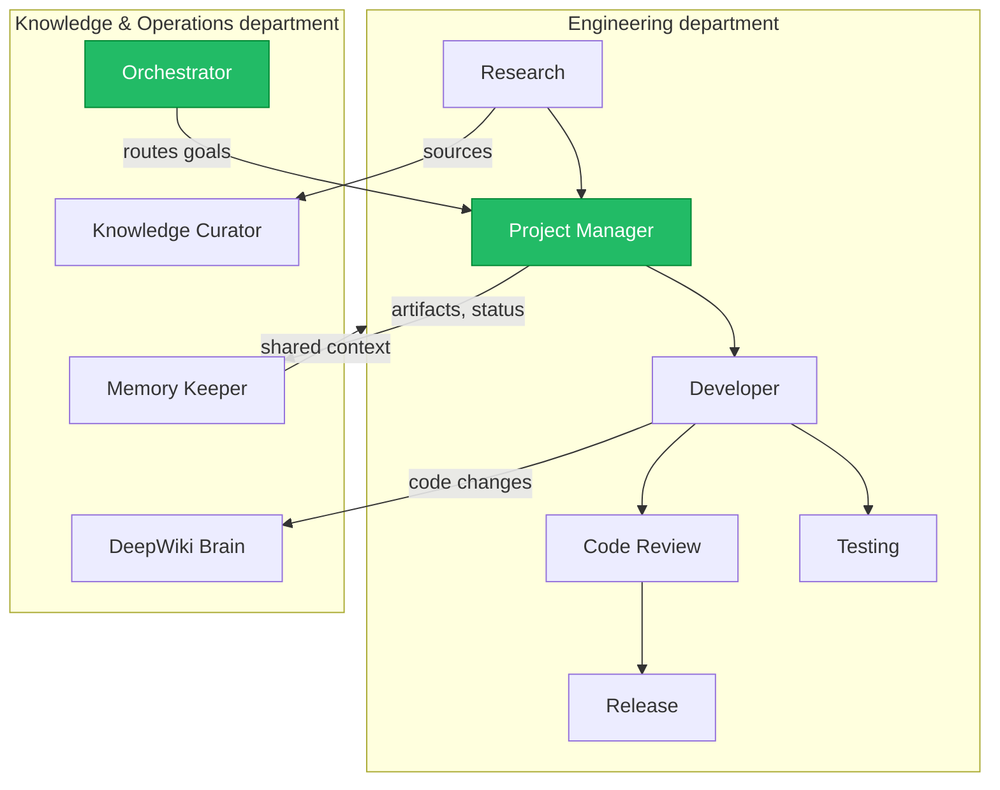
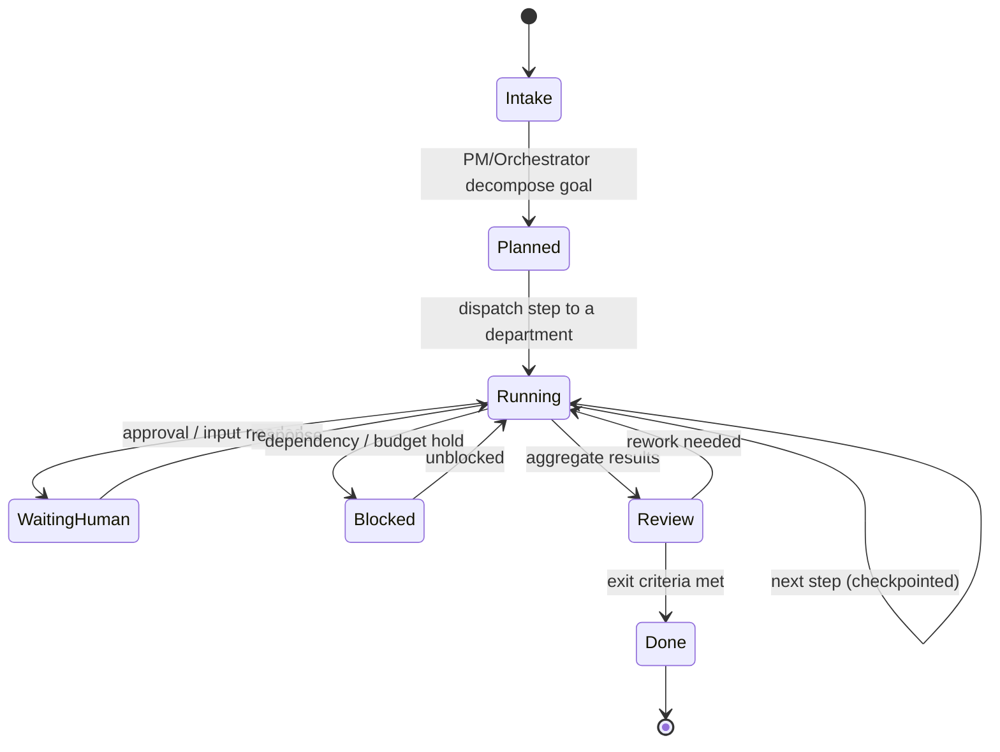
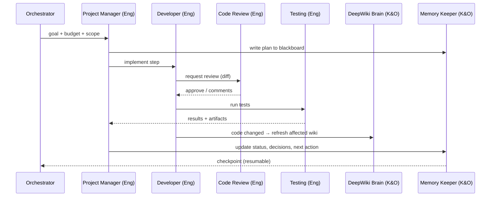

# 16 — Agent Departments (Harness, Knowledge & Memory Hub, Multi-Day Runs)

## 1. Purpose

This spec organizes the Hermes agent system (`10`) into **departments**, defines the
**Harness** that runs agents durably (including tasks that span **days**), and unifies
memory + DeepWiki + the knowledge graph into one **Knowledge & Memory Hub** the agents read
and write. It is the design layer for "lots of agents in different departments that work
together as a team."

**Relationship to `docs/10`:** `10` defines the *individual* agent (lifecycle, memory tiers,
permissions, tools, communication). This spec (`16`) defines how those agents are *grouped,
coordinated, and kept running* across a long task. `10` is the atom; `16` is the org chart
and the engine.

> **Status:** Designed. The runtime (Harness/`agentd`, supervisor, scheduler) lands at
> **Milestone 9** — it is *not* built ahead of the gate. The same department model is already
> usable **today** as Claude Code tooling: `.claude/agents/` subagents + the
> `.claude/orchestration/` coordination protocol (see §9).

## 2. Departments

Two departments cover the current vision; more can be added as config (`06`).

### 2.1 Engineering (Core)
Builds and verifies the product.

| Agent (role from `10 §2`) | Responsibility |
|---|---|
| **Project Manager** | Plans, decomposes goals into tasks, coordinates, updates roadmap/kanban. The department lead. |
| **Research** | Gathers/summarizes information with citations; fills the research queue. |
| **Developer** | Reads/writes code in a sandbox; proposes changes. |
| **Code Review** | Reviews diffs/PRs for correctness, style, and risk. |
| **Testing (QA)** | Generates/runs tests; reports results. |
| **Release** | Prepares release notes; coordinates release steps. |

### 2.2 Knowledge & Operations
Maintains the brain the whole company thinks with, and keeps long tasks running.

| Agent | Responsibility |
|---|---|
| **Knowledge Curator** *(exists)* | The **sorter**: files & rewrites every incoming document/link into the knowledge hub (`docs/knowledge/CURATION_RULES.md`). |
| **DeepWiki Brain** | Generates/maintains the living repo wiki + architecture docs, grounded in code (`09`). The "GitBook/DeepWiki brain." |
| **Memory Keeper** | Curates the Knowledge & Memory Hub: shared blackboard, decision log, glossary consistency, memory retention (`§5`). |
| **Orchestrator** | Runs the **Harness**: decomposes goals, routes work across departments, aggregates, checkpoints, enforces budgets/loop limits (`§4`, `§6`). |

**Boundaries.** Engineering may write code (sandboxed, external pushes gated); Knowledge &
Operations writes docs/memory, never product code. Both obey least-privilege (`10 §5`).

## 3. Department mission map

## 4. The Harness (agent runtime)

The Harness is what lets a single task **run for days** without a human babysitting it. It is
the runtime side of `10 §9`.

- **Executor (`agentd`):** runs each agent as a LangGraph graph with typed state, tool-call
  nodes, and cycles (iterate-until-done). One graph = one agent run.
- **Supervisor:** a LangGraph "supervisor" graph (owned by the Orchestrator/PM) that routes a
  goal to specialist agents and aggregates their results (`10 §7`).
- **Scheduler:** enqueues runs from triggers (domain events, plan steps, timers) and resumes
  checkpointed runs.

### 4.1 Running for days — durability model
- **Checkpointed state.** Every graph step is checkpointed (`10 §9`); a run can pause and
  resume without losing context. A multi-day task is a sequence of resumable checkpoints, not
  one long-held process.
- **No idle compute between steps.** Ephemeral by design (`10 §10`): the task "runs for days"
  as *elapsed* time, but only consumes compute while a step executes. Waiting states
  (`WaitingHuman`, scheduled next-step) hold **no** process.
- **Budget across the whole task.** A long task carries a cumulative budget (tokens/cost/time)
  and per-step limits; the Harness stops or escalates when a budget is exhausted rather than
  looping forever (`10 §10`).
- **Human-in-the-loop checkpoints.** Mutating/external actions pause at `WaitingHuman`; the
  task resumes from the exact checkpoint on approval.
- **Durable worklog.** Progress is written to the shared blackboard (`§5`) so any resumed run
  — even after a restart — reconstructs "where we are" from state, not memory.

### 4.2 Long-running task lifecycle

## 5. Knowledge & Memory Hub

One addressable "brain" the whole company reads and writes. It composes existing pieces
rather than adding a new store.

| Layer | What it holds | Backing (design) |
|---|---|---|
| **Working memory** | Current run state | LangGraph checkpoint (`10 §4`) |
| **Short-term memory** | Recent run outcomes, time-boxed | `agent_memory` (`05`) |
| **Long-term memory** | Durable facts/preferences/learnings | `agent_memory` + embeddings (Qdrant) |
| **Shared blackboard** | Project-team context (plan, decisions, glossary, handoffs) | project memory scope |
| **DeepWiki brain** | Living, grounded repo/architecture docs | `wiki_pages`, diagrams (`09`) |
| **Knowledge graph** | Entities & relationships | Neo4j (`11`) |
| **Docs knowledge hub** | Curated human/AI documents & sources | `docs/knowledge/` |

- **Retrieval** is GraphRAG (`12`): hybrid keyword (Meili) + vector (Qdrant) fused by RRF and
  enriched by graph traversal (Neo4j). Agents query the hub as a **tool** (`10 §6`).
- **Writes are curated.** The Memory Keeper and Knowledge Curator keep the hub deduplicated,
  scoped, and permissioned (`10 §5`); nothing authoritative is written only to a derived
  store (rebuildable projections rule).
- **Importance & eviction** govern retention (`Bible 03_Core_Systems/Memory_System.md`).

## 6. Inter-department coordination ("work together as a team")

Three mechanisms, all from `10 §7`, applied across departments:

1. **Message passing** — structured `agent_messages` between agents (PM → Developer assigns a
   task; Developer → Code Review requests a review).
2. **Shared blackboard** — the project memory scope every team agent can read: the current
   plan, decisions, open questions, and per-agent status. Decouples agents (no direct
   handoff needed to stay aligned).
3. **Supervisor routing** — the Orchestrator/PM supervisor graph decides *which* department
   handles the next step and aggregates results.

### 6.1 Cross-department flow (example)

## 7. Permissions & safety (per department)

Inherits `10 §5` and `10 §10`. Department defaults:
- **Engineering:** Developer/Testing get sandboxed code tools; external pushes (GitHub/Notion)
  require approval; Code Review is read + gated-comment.
- **Knowledge & Operations:** read-broad, write-docs/memory only; **no** product-code write;
  external publishing gated.
- All privileged/mutating actions are audited (`audit_log`, actor_type=`agent`).

## 8. Milestone mapping

| Piece | Where it lands |
|---|---|
| Department model & this design | **Now** (this spec) |
| Individual agent runtime, memory tables, tools | **M9** (`10`, `Bible 06_AI`) |
| Harness (`agentd`, supervisor, scheduler) | **M9** |
| DeepWiki brain generation | **M5/M9** (`09`) |
| Knowledge graph / GraphRAG retrieval | **M8** (`11`, `12`) |
| Claude Code department tooling (`.claude/`) | **Now** (see §9) |

This spec does **not** authorize building the runtime ahead of M9. M5 (GitHub) remains next.

## 9. Available today — Claude Code department tooling

The department model is operational right now, at the *tooling* level, so this repo can be
built and maintained by a team of agents before the product runtime exists:

- **Department subagents** — `.claude/agents/*.md` (e.g. `product-manager`, `researcher`,
  `engineer`, `code-reviewer`, `qa-tester`, `release-manager`, `deepwiki-brain`,
  `memory-keeper`, `orchestrator`, plus the existing `knowledge-curator`). Each is a real
  Claude Code subagent with least-privilege tools.
- **Coordination protocol** — `.claude/orchestration/`: a durable **blackboard** + worklog
  that lets a single task span many sessions (the tooling analogue of §5's shared blackboard)
  and be **resumed** by any session. This is how "run for days" works today: state lives in
  the repo, not in a session.
- **Supervisor** — the top-level Claude Code session follows the `orchestrator` playbook: it
  decomposes the task, invokes department agents, and checkpoints progress to the blackboard.

See `.claude/orchestration/README.md` for the operating procedure.

## 10. Testing (M9)

- Department routing: a goal reaches the correct department; the supervisor aggregates.
- Durability: a checkpointed multi-step task resumes after an interruption with intact state.
- Budget/loop guards halt a runaway task and escalate instead of looping.
- Blackboard coordination: two agents cooperate via shared state without a direct handoff.
- Least-privilege: a Knowledge & Operations agent cannot write product code.
