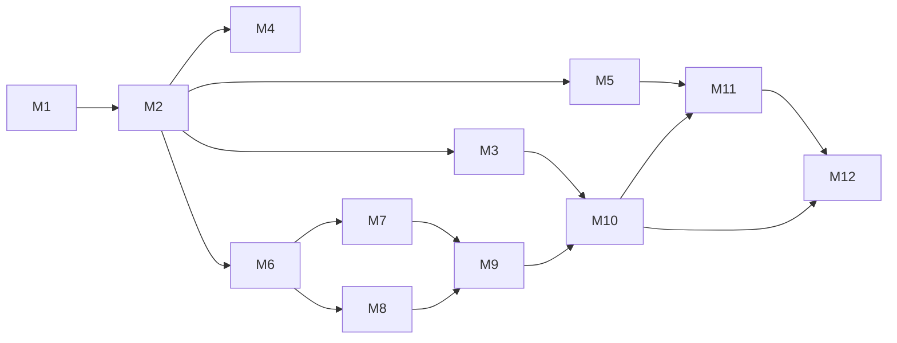

# Product Roadmap

## Purpose
Give a product-level view of *when* capabilities arrive and *why in that order*. Pairs with
the engineering roadmap in `docs/00-ROADMAP.md` and `09_Implementation/`.

## Current State
Milestone 0 (documentation) is complete. Nothing beyond it is built. Sequencing is driven
by dependency, not preference.

## Release themes

| Phase | Milestones | Product theme | User-visible outcome |
|-------|-----------|----------------|----------------------|
| **Foundation** | M1 | Runnable skeleton | Developers can run the stack locally. |
| **Core platform** | M2–M3 | Data + access | Projects/tasks/docs exist behind secure auth. |
| **Interfaces** | M4–M5 | Notion + GitHub | Work syncs with the tools people already use. |
| **Intelligence** | M6–M8 | Ingestion, search, graph | Upload → knowledge; ask anything. |
| **Autonomy** | M9 | AI agents | Agent teams do real work. |
| **Experience** | M10 | Dashboard | The unified workspace UI. |
| **Automation** | M11 | Workflows | Events drive automated actions. |
| **Production** | M12 | Hardening | One-command, backed-up, observable self-host. |

## Sequencing rationale
- **Data before features:** M2 domain model underpins everything.
- **Auth before external sync:** M3 must precede exposing/syncing data (M4–M5).
- **Ingestion before search/graph:** M6 produces the content M7/M8 index and connect.
- **Search + graph before agents:** M9 agents rely on retrieval (M7) and GraphRAG (M8).
- **Everything before the dashboard:** M10 surfaces already-working systems.
- **Automation and hardening last:** M11/M12 build on a complete platform.

## Milestone dependency graph

## Architecture Decisions
Each milestone is a **vertical slice** with an approval gate — the roadmap optimizes for
shippable, testable increments over broad-but-hollow progress.

## Alternatives Considered
- **UI-first** (rejected): a dashboard over empty systems demos well but delivers nothing
  real and creates rework.
- **Big-bang build** (rejected): unmanageable scope; the prompt and roadmap both mandate
  milestone gates.

## Future Improvements
Post-M12: plugin marketplace, team/enterprise features, mobile, federation, and
domain-specific packs — sequenced by adoption feedback.

## Implementation Notes
The roadmap is a living plan: update `09_Implementation/Current_Status.md` and
`CHANGELOG.md` at every gate. Do not start a milestone before the prior one is accepted.
