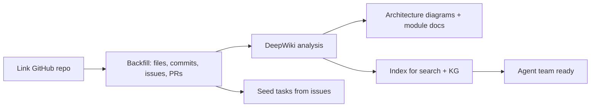
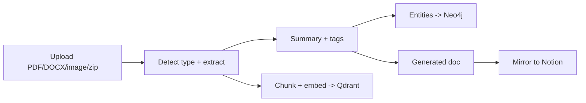
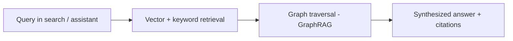
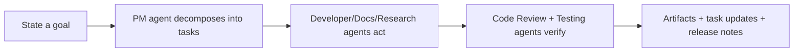
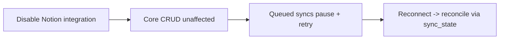

# User Workflows

## Purpose
Describe the end-to-end journeys that define the product experience. These are the
integration tests of the vision — if they work, Hermes works.

## Current State
Workflows are designed, not implemented. Each becomes an e2e test as its milestones land.

## Headline workflows

### W1 — Repo → Workspace (minutes)

*Value:* a new codebase becomes an understandable, planned, searchable workspace almost
immediately. *Milestones:* M5 (sync), M8 (KG), M9 (agents/DeepWiki).

### W2 — File → Knowledge (automatic)

*Value:* zero manual filing; every file becomes connected knowledge. *Milestone:* M6.

### W3 — Ask Anything (cited)

*Value:* answers across code, docs, research, files, conversations. *Milestones:* M7, M8.

### W4 — Plan & Execute with Agents

*Value:* routine work automated by an ephemeral agent team. *Milestone:* M9.

### W5 — Resilience (disconnect Notion)

*Value:* no lock-in; the product's defining guarantee. *Milestone:* M4 (tested).

## Supporting workflows
- **Research a topic** (W2-adjacent): topic → research agent → cited research items.
- **Generate documentation**: source → Documentation agent → published docs (MkDocs).
- **Automate on events**: event (PR merged, file ingested) → workflow → actions (M11).

## Architecture Decisions
Workflows are cross-cutting; they exercise multiple modules and datastores, validating the
event-driven design and the source-of-record/derived-store split.

## Alternatives Considered
Documenting only screen-level flows was rejected — the platform's value is in these
cross-system journeys, so they are first-class.

## Future Improvements
Add collaboration workflows (assign, review, comment), scheduled digests, and
domain-specific journeys (research lab, software team) as templates.

## Implementation Notes
Implement each workflow as a Playwright/e2e test (`08_Development/Testing_Strategy.md`).
W5 is the highest-priority resilience test and gates Milestone 4.
