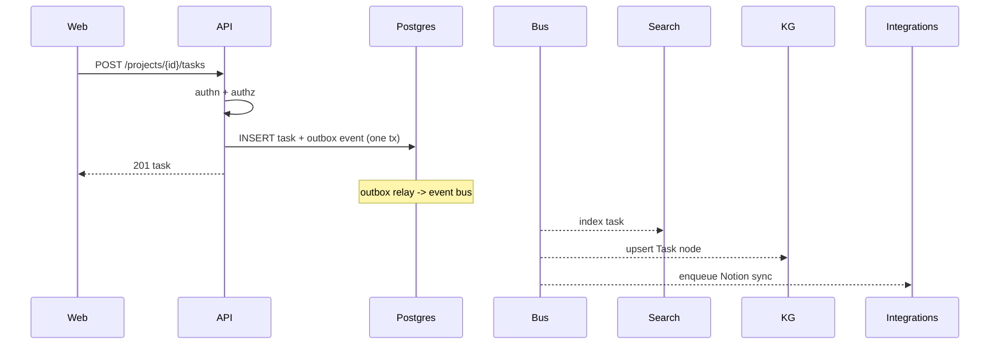
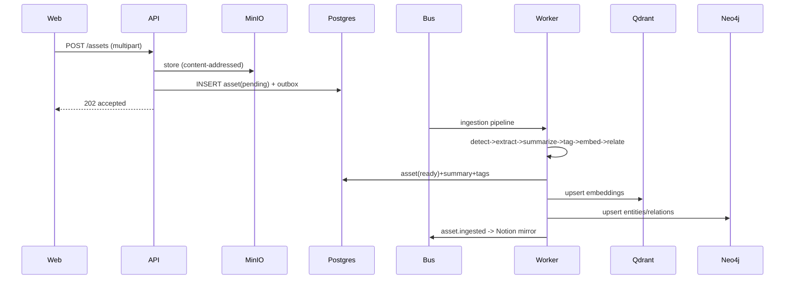
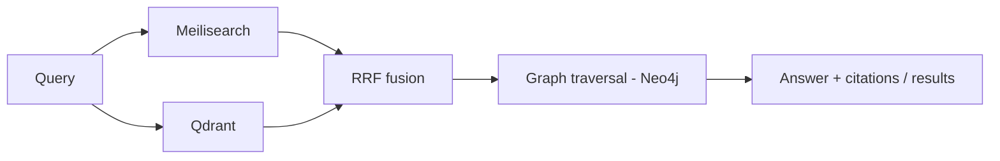

# Data Flow

## Purpose
Explain how data moves through Hermes for the key operations, and how consistency is
maintained across the source of record and derived stores.

## Current State
Flows are designed (`docs/03 §6`); unimplemented. This entry is the canonical summary.

## Principle
**Write to Postgres, emit an event, project everywhere else.** Postgres is authoritative;
search/graph/integration surfaces are asynchronous projections that can be rebuilt.

## Flow 1 — Synchronous write (create task)

## Flow 2 — Asynchronous ingestion (upload file)

## Flow 3 — Retrieval (search / GraphRAG)

## Consistency model
- **Outbox pattern:** the domain write and its event commit in one transaction; a relay
  publishes to the bus → no lost events on crash.
- **Idempotent consumers:** dedupe on event `id`; safe to retry.
- **Rebuildable projections:** `reindex`/`rebuild-graph` jobs regenerate Qdrant, Meili, and
  Neo4j from Postgres + MinIO using the `embedding_refs`/`graph_refs` bridge tables.
- **External sync:** `sync_state` tracks external ids/versions/checksums; conflict policy
  defaults to *Hermes wins*; loops prevented via last-write comparison + `webhook_events`
  idempotency.

## Architecture Decisions
1. **Never write authoritative data only to a derived store.**
2. **Bridge tables** (`embedding_refs`, `graph_refs`, `relationships`) tie derived records
   back to Postgres for rebuild/delete/consistency.
3. **Degradation over failure:** if a derived store or integration is down, core writes
   still succeed and projection work re-queues.

## Alternatives Considered
- **Dual-write without outbox** — rejected: risks lost/inconsistent events on failure.
- **Synchronous projection** — rejected: couples request latency to indexing/graph work.

## Future Improvements
Change-data-capture (e.g. Postgres logical replication) as an alternative to the outbox at
scale; per-stream backpressure and dead-letter handling.

## Implementation Notes
- Deletes cascade to derived stores via bridge tables + Meili doc ids.
- Every event carries `{id, type, occurred_at, workspace_id, actor, payload, trace_id}`.
- Reconciliation jobs catch drift from missed webhooks/events.
