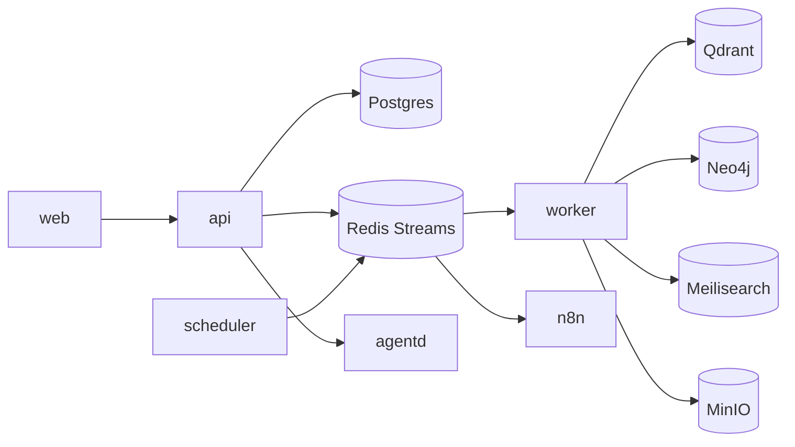

# Service Architecture

## Purpose
Define the deployable services, their responsibilities, and boundaries — the operational
decomposition of the system.

## Current State
Services are specified, not built. They will be created as real code from Milestone 1
(skeleton) and fleshed out through later milestones.

## Services
| Service | Tech | Responsibility | Milestone |
|---------|------|----------------|-----------|
| **web** | Next.js/TS | UI, Auth.js sessions, SSR/RSC, calls the API. | M1/M10 |
| **api** | FastAPI | Gateway + core modules; validate, authorize, persist, emit events. | M1/M2 |
| **worker** | Celery | Async jobs: ingestion, sync, analysis, indexing, KG updates. | M1/M6 |
| **agentd** | LangGraph | Executes agent graphs; tool calls; memory; artifacts. | M9 |
| **scheduler** | Celery beat | Cron: polling syncs, digests, backups. | M4/M12 |
| **n8n** | n8n | Visual automation runtime. | M11 |

Backing stores (not services we build): Postgres, Redis, Neo4j, Qdrant, Meilisearch,
MinIO — run as containers in the compose stack.

## Boundaries & communication
- **Shared code:** api/worker/agentd/scheduler share `packages/hermes-domain` and
  `hermes-core`; they differ only by entrypoint. No duplicated domain logic.
- **Sync path:** clients → `api` (REST/OpenAPI). 
- **Async path:** `api` emits events (outbox → Redis Streams) → `worker`/`agentd`/`n8n`
  consume.
- **No direct DB sharing across trust boundaries:** external tools reach data only through
  the api/integration layer, never the database directly.

## Architecture Decisions
1. **Separate `agentd`** so long, bursty, expensive agent runs don't compete with request
   handling or ingestion throughput.
2. **Separate `worker`/`scheduler`** for independent scaling of async load.
3. **n8n as a peer service**, bridged via events, rather than embedded — keeps automation
   replaceable and isolated.

## Alternatives Considered
- **One process for everything** — simplest to start but couples scaling and failure
  domains; rejected beyond the earliest skeleton.
- **Full microservices** — premature; the shared-package modular split gives most benefits
  with less ops cost.

## Future Improvements
Independent horizontal scaling per service; per-service resource limits; optional
splitting of search/ingestion into their own services under load; Helm chart (M12).

## Implementation Notes
- In Milestone 1, `api` and `worker` can share a minimal image; `agentd` and `n8n` arrive
  at M9/M11.
- Health endpoints per service aggregate into a stack health view.
- Each service reads the same env-driven plugin config so provider selection is uniform.
