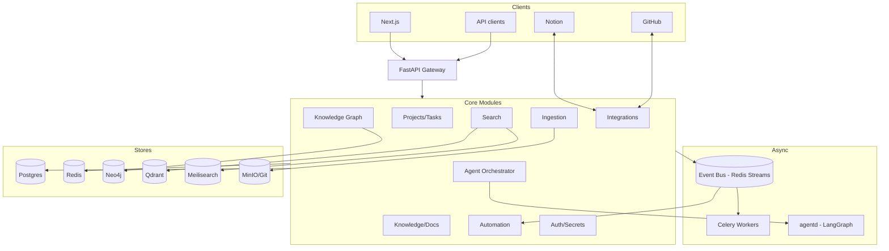

# System Architecture

## Purpose
Give the authoritative high-level picture of how Hermes is structured and how its parts
communicate. Canonical deep spec: `docs/03-SYSTEM_ARCHITECTURE.md`.

## Current State
Architecture is fully designed; **no services exist yet** (Milestone 0). This entry is the
stable summary and decision record.

## Shape
A **modular, service-oriented monolith-of-modules**: one core composed of bounded modules,
plus dedicated services (workers, agent runtime, scheduler) and stateful backing stores.
Small enough to self-host on one machine; modular enough to split later without rewrites.

## Architecture Decisions
1. **Source of record = Postgres.** All interfaces sync to/from it; derived stores
   (Neo4j/Qdrant/Meili) are rebuildable projections.
2. **Ports & adapters (hexagonal).** Core depends on interfaces; providers are plugins.
3. **Async by default.** Slow work (ingestion, sync, agents, analysis) runs on the queue.
4. **Event-driven with a transactional outbox.** Domain write + event are atomic; no lost
   events; consumers are idempotent.
5. **Shared domain packages.** api/worker/agentd/scheduler share `packages/hermes-*`,
   giving module isolation without code duplication.

## Alternatives Considered
- **Microservices from day one** — rejected: operational overhead unjustified for the
  current stage; the modular monolith can be decomposed later along existing seams.
- **Synchronous processing** — rejected: AI/integration/ingestion latency would block
  requests and harm UX.
- **Single datastore** — rejected: relational/graph/vector/keyword each serve distinct
  retrieval needs (see `Technology_Stack.md`).

## Future Improvements
Extract high-load modules (search, agentd, ingestion) into independent services; add
read replicas; introduce a message broker upgrade path if Redis Streams limits appear.

## Implementation Notes
- Modules never import another module's repositories — they call services or react to
  events.
- `outbox` table drains to the bus; every consumer dedupes on event `id`.
- A `reindex`/`rebuild` job regenerates derived stores from Postgres + MinIO — this is the
  operational definition of "source of record."
- Realtime (activity, agent progress, search-as-you-type) via SSE/WebSocket.
