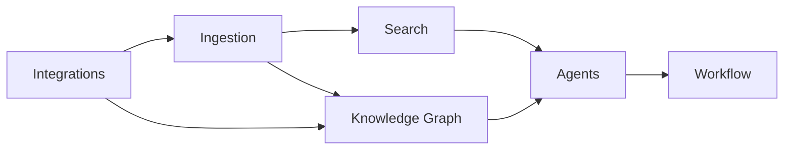

# Core Systems (Overview)

## Purpose
Index the core subsystems of Hermes and how they fit together, so readers can navigate to
the right deep-dive.

## Current State
All core systems are designed; none implemented. Each has its own Bible entry and numbered
spec.

## The core systems
| System | Bible entry | Spec | Milestone | Role |
|--------|-------------|------|-----------|------|
| **Agent System** | `Agent_System.md` | `docs/10` | M9 | Ephemeral, tool-using AI agent teams. |
| **Memory System** | `Memory_System.md` | `docs/10 §4` | M9 | Working/short/long-term + shared agent memory. |
| **Knowledge System** | `Knowledge_System.md` | `docs/11` | M8 | Entities, relationships, GraphRAG. |
| **Search System** | `Search_System.md` | `docs/12` | M7 | Hybrid semantic + keyword retrieval. |
| **Workflow System** | `Workflow_System.md` | `docs/14` | M11 | n8n + native event automation. |
| **Ingestion** | (in `05_Data`/`docs/13`) | `docs/13` | M6 | File → knowledge pipeline (feeds all above). |
| **Integrations** | `04_Integrations/*` | `docs/07`,`08` | M4/M5 | Notion/GitHub sync. |

## How they interconnect

Ingestion produces the content; Search and the Knowledge Graph make it findable and
connected; Agents reason over both; Workflows automate reactions; Integrations feed and
mirror everything. All sit on the shared event bus and source-of-record DB.

## Architecture Decisions
Core systems are **modular and event-connected**, not tightly coupled: each consumes/emits
domain events and depends on ports (search, graph, AI) rather than on each other's internals.

## Alternatives Considered
A monolithic "AI engine" combining search+graph+agents was rejected — separate systems are
independently testable, replaceable, and scalable.

## Future Improvements
Add new core systems as plugins (e.g. a notifications system, an evaluation system —
see `06_AI/Evaluation_System.md`) without disturbing existing ones.

## Implementation Notes
Build order follows dependencies: ingestion (M6) → search (M7) → graph (M8) → agents (M9)
→ workflows (M11). Each must update its Bible "Current State" as it lands.
