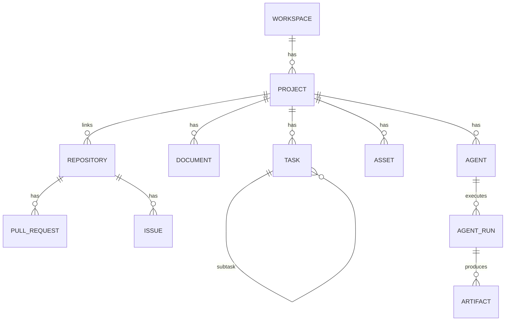

# Data Models

## Purpose
Summarize the core domain entities and their relationships so developers share one mental
model. Full DDL-level detail: `docs/05-DATABASE_DESIGN.md`.

## Current State
**Partially implemented (M2).** The core hierarchy — `workspaces`, `projects`, `tasks` —
is implemented as SQLAlchemy 2.0 models with an Alembic migration (`database/migrations/
versions/0001_initial_core_schema.py`) and full CRUD API. The remaining entities below are
designed and follow the same pattern in subsequent M2 PRs. **Portability note:** models use
SQLAlchemy's portable types (`Uuid`, `String`, `DateTime`) so the same code runs on SQLite
(tests/CI) and PostgreSQL (production source of record); Postgres-specific optimizations
(JSONB, arrays, RLS) are layered in later.

## Entity groups
- **Identity & tenancy:** `workspaces`, `users`, `teams`, `user_memberships`,
  `project_members`, `api_tokens`.
- **Work management:** `projects`, `tasks`, `task_dependencies`, `roadmap_items`,
  `decisions`, `meetings`, `ideas`.
- **Knowledge:** `documents`, `document_versions`, `document_links`, `diagrams`.
- **Repositories:** `repositories`, `commits`, `pull_requests`, `issues`, `repo_files`,
  `wiki_pages`.
- **Files:** `assets`, `asset_derivatives`.
- **Cross-cutting links:** `tags`, `tag_links`, `embedding_refs`, `graph_refs`,
  `relationships`.
- **Agents:** `agents`, `agent_runs`, `agent_memory`, `agent_messages`, `artifacts`.
- **Integrations/sync:** `integrations`, `sync_state`, `sync_log`, `webhook_events`.
- **Automation:** `workflows`, `workflow_runs`.
- **Security/ops:** `secrets`, `audit_log`, `outbox`.

## Core relationships (simplified)

## Key modeling choices
- **Polymorphic links:** `tag_links`/`embedding_refs`/`graph_refs` key on
  `(entity_type, entity_id)` — one mechanism for all entities.
- **Versioned documents:** `document_versions` keeps full history + `content_hash`.
- **External linkage:** `source` + `external_ref`/`sync_state` connect records to
  Notion/GitHub without making them authoritative.
- **Enums** for stable status vocabularies (task/project/agent/asset statuses).

## Architecture Decisions
1. **Names match across DB ↔ API ↔ KG ↔ UI** to minimize translation (see `Glossary.md`).
2. **`metadata jsonb` escape hatch** on major entities for plugin/forward-compat data
   without schema churn.
3. **Bridge tables are the consistency backbone** for derived stores.

## Alternatives Considered
- **Per-entity tag/embedding tables** — rejected: duplication and rigidity; polymorphic
  links chosen.
- **Storing content only in Notion** — rejected (source-of-record principle).
- **No version history** — rejected for documents; history is a product feature.

## Future Improvements
Add richer relationship metadata, per-entity ACL columns if needed, and generated TS/Pydantic
types from a single schema definition.

## Implementation Notes
- Implement models module-by-module starting with Projects/Tasks (M2 reference module).
- Index all FKs and common filters; GIN on `jsonb`/`text[]`; partial indexes for
  `deleted_at IS NULL`.
- Keep Pydantic schemas and SQLAlchemy models aligned; generate the TS client from OpenAPI.
