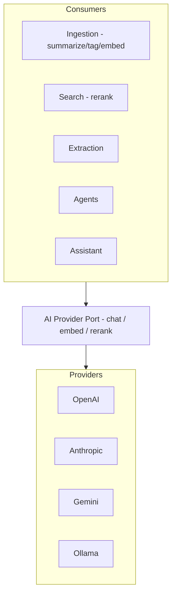

# AI Architecture

## Purpose
Describe how AI capabilities are structured across Hermes: providers, where inference
happens, and how AI is kept swappable and grounded.

## Current State
Designed; unimplemented (AI features land M6+ for embeddings, M9 for agents). No provider
code exists yet.

## Layers

- **Single AI provider port** (`chat`, `embed`, optional `rerank`, capabilities) — all AI
  access flows through it (`docs/06`).
- **Consumers:** ingestion (summaries/tags/embeddings), extraction (entities), search
  (reranking), agents (reasoning/tools), assistant (grounded answers).
- **Grounding:** user-facing generation is grounded via GraphRAG (`03_Core_Systems/
  Knowledge_System.md`) with citations — not open-domain chat.

## Architecture Decisions
1. **Provider-agnostic via one port** → swap/mix providers per workspace/agent/run.
2. **Local-first option (Ollama)** for privacy and zero-cost inference.
3. **Grounded generation** with citations to reduce hallucination and build trust.
4. **Capability detection** so features degrade gracefully (streaming, tools, modalities).

## Alternatives Considered
- **Hardcoding one provider** — rejected (lock-in, no local option).
- **A heavyweight AI framework spanning everything** — rejected in favor of a thin port +
  LangGraph for agents specifically.
- **Ungrounded LLM answers** — rejected; contradicts the "cited answers" goal and a non-goal
  (not a general chatbot).

## Future Improvements
Model routing (cheap model for easy tasks, strong model for hard ones), a caching/gateway
layer for cost, multimodal expansion (vision/audio already used in ingestion), and an
evaluation harness (`Evaluation_System.md`).

## Implementation Notes
- Embeddings and chat models are configured separately (can mix, e.g. local embeddings +
  hosted reasoning).
- Never pass raw secrets to models; adapters handle auth in-process.
- Record token usage/cost per agent run for budgeting and observability.
- **Decision Required:** default chat + embedding providers/models (D1, D5).
