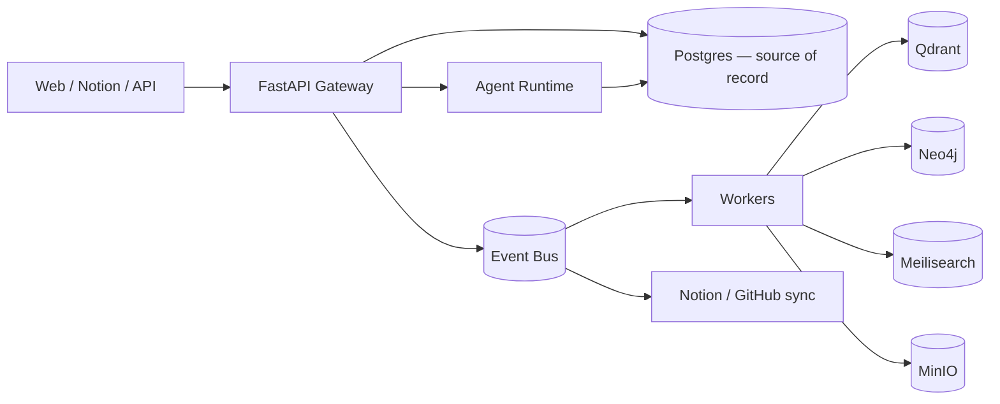

# Project Map

A single-page orientation to the repository: what exists, where things live, how the
system is meant to be built and run, and how data flows. This is the fast on-ramp for
any developer or Claude Code session.

> **Status reminder:** Hermes is at **Milestone 0 (documentation only)**. Items marked
> _(planned)_ describe the intended implementation and do **not** exist in the tree yet.

---

## 1. System overview

Hermes Workspace OS is a self-hostable AI operating system for knowledge work. Its own
**PostgreSQL database is the source of record**; Notion, GitHub, and other tools are
replaceable interfaces synced to/from it. The platform is composed of modular services
behind a FastAPI gateway, with an event-driven async plane (Celery + Redis Streams) and
derived stores (Neo4j, Qdrant, Meilisearch) that are always rebuildable from Postgres.

Read next: `docs/PROJECT_BIBLE/00_Overview/Vision.md` → `02_Architecture/System_Architecture.md`.

## 2. Current repository layout (actual)

```
Hermes-Workspace-OS/
├── README.md                     # Project intro + docs index
├── LICENSE                       # Apache-2.0
├── CLAUDE.md                     # Entry point for Claude Code sessions
├── CONTRIBUTING.md               # How to contribute
├── CHANGELOG.md                  # Keep-a-Changelog history
├── .gitignore
└── docs/
    ├── 00-ROADMAP.md ... 15-UI_DESIGN.md   # Numbered design specifications
    ├── AUDIT_REPORT.md           # Repository audit (this pass)
    ├── PROJECT_MAP.md            # This file
    ├── MISSING_INFORMATION.md    # Open decisions / gaps / risks
    └── PROJECT_BIBLE/            # Structured source of truth (see its README)
```

## 3. Intended repository layout _(planned, from Milestone 1)_

Created **only when it holds real code** (no empty folders are committed):

```
Hermes-Workspace-OS/
├── apps/
│   └── web/                 # Next.js dashboard (frontend)
├── services/
│   ├── api/                 # FastAPI gateway + core modules
│   ├── worker/              # Celery workers (ingestion, sync, indexing)
│   ├── agentd/              # LangGraph agent runtime
│   └── scheduler/           # Celery beat (cron)
├── packages/
│   ├── hermes-domain/       # Entities, value objects, domain events
│   ├── hermes-core/         # Services, repositories, plugin registry
│   ├── hermes-plugins/      # Provider interfaces + built-in adapters
│   └── ts-client/           # Generated TS API client + shared types
├── database/                # Alembic migrations, seed data, bootstrap scripts
├── infrastructure/          # Dockerfiles, compose stacks, (optional) Helm
├── config/                  # .env.example, provider config templates
├── scripts/                 # Dev/ops scripts (setup, reindex, backup)
├── tests/                   # Cross-service e2e
├── examples/                # Example configs / sample data
└── .github/                 # CI workflows, issue/PR templates
```

> This mirrors `docs/04-TECH_STACK.md §10`. See
> `docs/PROJECT_BIBLE/02_Architecture/Service_Architecture.md` for service boundaries.

## 4. Important documents (where to look)

| Question | Document |
|----------|----------|
| Why does this exist? | `PROJECT_BIBLE/00_Overview/Vision.md`, `docs/01-VISION.md` |
| What are we building? | `PROJECT_BIBLE/01_Product/*`, `docs/02-PRODUCT_REQUIREMENTS.md` |
| How is it structured? | `PROJECT_BIBLE/02_Architecture/*`, `docs/03-SYSTEM_ARCHITECTURE.md` |
| What tech and why? | `PROJECT_BIBLE/02_Architecture/Technology_Stack.md`, `docs/04-TECH_STACK.md` |
| Data model? | `PROJECT_BIBLE/05_Data/*`, `docs/05-DATABASE_DESIGN.md` |
| How do plugins work? | `docs/06-PLUGIN_ARCHITECTURE.md` |
| Agents? | `PROJECT_BIBLE/03_Core_Systems/Agent_System.md`, `docs/10-AGENT_SYSTEM.md` |
| How should Claude Code behave? | `PROJECT_BIBLE/10_Claude_Code/*`, `CLAUDE.md` |
| What's decided / undecided? | `docs/MISSING_INFORMATION.md` |
| What's the status/plan? | `PROJECT_BIBLE/09_Implementation/*`, `docs/00-ROADMAP.md` |

## 5. Key dependencies _(declared; not installed yet)_

- **Runtime services:** PostgreSQL, Redis, Neo4j, Qdrant, Meilisearch, MinIO, n8n.
- **Backend:** FastAPI, Pydantic, SQLAlchemy, Alembic, Celery, LangGraph.
- **Frontend:** Next.js, React, Tailwind, shadcn/ui, React Flow, Mermaid, ECharts.
- **AI providers (pluggable):** OpenAI, Anthropic, Gemini, Ollama.

Full rationale: `PROJECT_BIBLE/02_Architecture/Technology_Stack.md`.

## 6. Development entry points _(planned)_

| Task | Command (target) |
|------|------------------|
| Bring up full stack | `docker compose up -d` (from `infrastructure/compose`) |
| Run API (dev) | `just api` → `uvicorn` on `services/api` |
| Run web (dev) | `pnpm --filter web dev` |
| Run workers | `just worker` → Celery |
| Migrations | `just migrate` → Alembic |
| Tests | `just test` (pytest + vitest), `just e2e` (Playwright) |
| Lint/format/types | `just check` (ruff, mypy, eslint, tsc) |

> The `Justfile`, `docker-compose.yml`, and `.env.example` are Milestone 1 deliverables.

## 7. Build process _(planned)_

1. Python packages built with `uv` from `pyproject.toml`; services share
   `packages/hermes-*`.
2. Frontend built with `pnpm` workspaces (Next.js build).
3. OpenAPI schema generated from FastAPI → TypeScript client generated into
   `packages/ts-client` (the frontend/backend contract seam).
4. Docker images built per service via `infrastructure/docker/*`.
5. CI (GitHub Actions): lint → type-check → test → build on every PR.

## 8. Deployment process _(planned)_

- **Self-host default:** single-host `docker compose up` runs web, api, worker, agentd,
  scheduler, n8n, and all datastores.
- **Scale-out (later):** api/worker/agentd scale horizontally; datastores externalized;
  optional Helm chart (Milestone 12).
- **Config:** 12-factor env vars; provider selection via the plugin registry.
- Details: `docs/03-SYSTEM_ARCHITECTURE.md §11`, `PROJECT_BIBLE/08_Development/Deployment.md`.

## 9. Data flow (high level)



Writes hit Postgres and emit events (via a transactional outbox); consumers project
into search, graph, and integration surfaces. Everything derived can be rebuilt from
Postgres + MinIO. Deep dive: `PROJECT_BIBLE/02_Architecture/Data_Flow.md`.

## 10. Glossary & conventions

Terminology in `PROJECT_BIBLE/00_Overview/Glossary.md`; coding/git conventions in
`PROJECT_BIBLE/08_Development/*` and `PROJECT_BIBLE/10_Claude_Code/*`.
